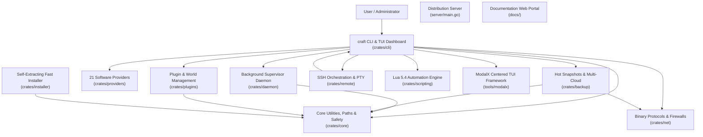

# Comprehensive Project Analysis: Craft Workspace

> **Repository**: `OguzhanUmutlu/craft`  
> **Workspace Model**: Multi-crate Rust Workspace CLI & Background Supervisor Daemon, Standalone Fast Installer, Go Distribution Server, and Documentation Portals  
> **Primary Language**: Rust (2021 Edition, MSRV 1.80+)  
> **Codebase Scale**: ~34,000+ Rust lines across 12 workspace crates (plus Go, React 18 TSX, VitePress, and Shell tooling)  
> **Current Version**: `v1.0.0`

---

## 1. Executive Overview

**Craft** is a modular, high-performance server management suite, background supervisor daemon, interactive terminal user interface (TUI) powered by ModalX, and remote orchestration engine designed for Minecraft and dedicated game servers. It bridges the gap between simple command-line wrappers and complex multi-server panels (such as Pterodactyl or AMP), packing full server lifecycle orchestration into a single native binary (<15 MB) with sub-millisecond startup times and a minimal memory footprint (<10 MB RSS for the daemon supervisor).

Craft provides end-to-end server lifecycle management across **21 server platforms** spanning Java Edition, Bedrock Edition, Proxies, and Native Game Engines (Factorio, Terraria, Palworld, Valheim, and Custom Lua/Binary engines). It features typed IPC background supervision, atomic zero-downtime hot backups, cross-platform remote orchestration over SSH, native binary protocol diagnostics (SLP, RakNet, A2S_INFO, RCON), multi-repository plugin/mod management, Zstandard-compressed caching, and an interactive TUI dashboard driven by ModalX.

---

## 2. Workspace Crate Composition and Topology

The Craft ecosystem is organized into 11 specialized Rust crates, a Go binary service, and web documentation portals:

| Layer / Crate | Path | Primary Role and Capabilities |
| :--- | :--- | :--- |
| **`craft-core`** | [`crates/core/`](../crates/core) | Filesystem isolation (`CraftPaths`), process locking (`server.lock`), dynamic Java discovery, bytecode inspection (`0xCAFEBABE`), LRU zstd artifact cache, non-destructive `TrashManager` (files & dirs), dynamic memory optimizer (`MemoryOptimizer`), multi-tenant role-based access control (`RbacRegistry`, `Role`, `Permission`, `UserAccount`), cryptographic append-only audit ledger (`AuditLedger`, HMAC-SHA256 hash chaining), pure-Rust ChaCha20-Poly1305 AEAD cipher and PBKDF2/SHA-256 (`crypto.rs`), multi-cloud storage mesh topology (`MeshRegistry`, `MeshTarget`, `MeshPolicy`), disaster recovery runbooks (`DrPlan`, `DrRunbook`), rolling time-series analysis (`RollingTimeSeries`, OLS regression, Z-score anomaly detection, TTE prediction, GC sawtooth detection), operational intelligence policies (`IntelligencePolicy`, `IntelligenceRegistry`, `intelligence.lock`), global edge mesh configuration (`EdgeRegistry`, `EdgeNode`, `GeoRoutingPolicy`, `PlayerSessionHandoff`, `CrossRegionChatEnvelope`, `BackboneCondition`, `LatencyPlaybook`, `edge.lock`), multi-cluster canary rollouts and autonomous fleet healing models (`RolloutRegistry`, `RolloutPlan`, `RolloutRecord`, `RolloutStage`, `RolloutStrategy`, `CanaryHealthCriteria`, `FleetHealthStatus`, `FleetHealingAction`, `rollouts.lock`), unified inverted log indexing and incident forensics data structures (`InvertedIndexBlock`, `LogEntry`, `LogQuery`, `LogSearchResult`, `LogLevel`, `StackFrame`, `CulpritType`, `IncidentTimeline` with HMAC-SHA256 authenticity proof, `demangle_stack_trace`), deterministic seasonal workload forecasting and cost optimization ledger (`ForecastingRegistry`, `SeasonalForecaster`, `DiurnalHourProfile`, `DayOfWeekProfile`, `CostOptimizationModel`, `CostOptimizationReport`, `ResourceTier`, `ResourceThrottlingPlan`, `WorkloadPolicy`, `forecasting.lock`), modpack CI/CD data models and atomic registry (`ModpackRegistry`, `ModpackBuildManifest`, `ModpackComponent`, `ModSide`, `BinaryDeltaHeader`, `DeltaOp`, `DeltaPatchManifest`, `modpack.lock`), zero-trust overlay mesh topology and microsegmentation data models (`SdnRegistry`, `SdnMeshConfig`, `LocalNodeConfig`, `WireguardPeer`, `IsolationZone`, `FilterProtocol`, `FilterAction`, `MicrosegmentationRule`, `MicrosegmentationPolicy`, `sdn.lock`), autonomous cgroups v2 resource isolation and fair-share scheduling models (`ServerPriority`, `ServerResourceLimit`, `TenantQuota`, `CgroupStatSnapshot`, `QuotaUsageSummary`, `CgroupV2Driver`, `QuotaRegistry`, `quotas.lock`, `~/.craft/quotas/`, `~/.craft/cgroups/`), distributed real-time tracing and OpenTelemetry models (`TraceId`, `SpanId`, `TraceContext`, `RecordedSpan`, `SpanRingBuffer`, `TraceTree`, `TraceSampler`, `OtlpJsonExporter`, `TracingConfig`, `TracingRegistry`, `tracing.lock`, `~/.craft/tracing/`), hardware-accelerated Anvil storage engine, io_uring driver and direct memory chunk cache (`AnvilConfig`, `AnvilRegistry`, `AnvilIoEngine`, `AnvilChunkCache`, `RegionFileReader`, `RegionFileWriter`, `ChunkLocation`, `anvil.lock`, `~/.craft/anvil/`, `~/.craft/cache/anvil/`), autonomous NUMA-aware topology discovery, CPU core pinning registry, hugepage management and kernel boot argument generator (`NumaTopology`, `NumaNode`, `NumaPolicy`, `NumaRegistry`, `ServerPinningConfig`, `CpuAffinityManager`, `KernelBootParams`, `numa.lock`, `~/.craft/numa/numa.toml`), Multi-Raft partitioning, joint consensus membership, and log compaction models (`MultiRaftRegistry`, `MultiRaftPartition`, `PartitionRoutingKey`, `JointConsensusPhase`, `MembershipChangeType`, `LearnerSyncProgress`, `RaftSnapshotMeta`, `SnapshotChunk`, `WalCompactionPolicy`, `multiraft.lock`, `~/.craft/raft/groups/`, `~/.craft/raft/multiraft.toml`), transactional registries (`ServersRegistry`, `AutoscaleRegistry`, `RemotesRegistry`, `GlobalBackupRegistry`, `ClustersRegistry`, `WebhooksRegistry`), properties parsing. |
| **`craft-providers`** | [`crates/providers/`](../crates/providers) | 21 server platforms across Java, Bedrock, Proxies, and Native games. Dynamic software provider loader (`craft.custom.toml`), asset resolution, automated GC tuning profiles (`--aikar`, `--zgc`, `--shenandoah`), in-memory embedded fallback catalogs. |
| **`craft-daemon`** | [`crates/daemon/`](../crates/daemon) | Detached background supervisor process, typed IPC over Unix sockets (`daemon.sock`) and Named Pipes (`\\.\pipe\craft-daemon`), 50k-line circular log ring buffer, stdin command injection, OS service unit generation, Prometheus `/metrics` exposition, event-driven webhooks (`Discord`, `Slack`, `GenericJson`), authenticated WebSocket console gateway, embedded zero-dependency Web Dashboard SPA (`DASHBOARD_HTML`) & REST API (`/api/auth`, `/api/servers`, `/api/audit`, `/api/rbac`, `/api/ai`, `/api/edge`), background storage monitor, idle hibernation manager (`HibernationManager`), in-process `EdgeStateBroker` (single-use player session handoff tokens, HMAC cross-region chat, dynamic playbook executor), autonomous intelligence autopilot (`AutopilotEngine`), real-time `TickService` background telemetry coordinator, autonomous `FleetHealer` background evaluation loop (canary bake observation, automated snapshot rollback restoration, node self-healing), embedded zero-dependency log indexer and ingestion service (`LogIngestionService`, 5,000-line `InvertedIndexBlock` chunk writer, active buffer ring, incident post-mortem recording), in-process predictive workload forecasting and cost optimization engine (`WorkloadForecastingService`, seasonal diurnal curve fitting, proactive wake schedules ahead of surges, quiet-hour hibernation downscaling), high-throughput modpack distribution service (`ModpackDistributionService`, RFC 7233 partial HTTP `Range: bytes=X-Y` streaming, binary delta deployment), in-process SDN overlay supervisor (`SdnService`, typed IPC for `GetSdnTopology`, `ApplySdnPolicy`, `RotateSdnKeys`, `GetPeerStatus`), in-process resource quota supervisor (`QuotaService`, typed IPC for `GetServerQuota`, `SetServerQuota`, `GetTenantQuota`, `SetTenantQuota`, `ListQuotaUsage`, `EnforceFairShareNow`), in-process distributed tracing supervisor (`TracingService`, OTLP/HTTP batch exporter, query filtering, causal tree generation, typed IPC for `GetTracingStatus`, `QueryTraces`, `GetTraceDetails`, `ExportTracesNow`, `SetTracingConfig`), in-process hardware-accelerated Anvil storage service (`AnvilService`, typed IPC for `GetAnvilStatus`, `InspectRegion`, `PrefetchChunks`, `BenchmarkAnvil`, `SetAnvilConfig`), in-process DPDK packet engine and NUMA supervisor (`DpdkNumaService`, typed IPC for `GetNumaStatus`, `PinServerCores`, `SetNumaPolicy`, `BenchmarkNumaMemory`, `GetDpdkStatus`, Prometheus metrics `craft_dpdk_*`, `craft_numa_*`), and in-process Multi-Raft and compaction service (`MultiRaftService`, typed IPC for `RaftGetMultiRaftStatus`, `RaftReconfigureMembership`, `RaftTriggerCompaction`, `RaftRoutePartitionKey`, `RaftManagePartition`, Prometheus metrics `craft_raft_groups_total`, `craft_raft_log_compaction_runs_total`, `craft_raft_snapshot_bytes_total`, `craft_raft_snapshot_chunks_total`, `craft_raft_joint_consensus_transitions_total`). |
| **`craft-net`** | [`crates/net/`](../crates/net) | Pure Rust networking protocols: Java SLP (TCP VarInt handshake), Bedrock RakNet (UDP 0x01), Valve A2S_INFO query, async RCON client, pure-Rust TCP `SleepProxy` (sleeping MOTD, login packet wake), host firewall automation (iptables, UFW, netsh, pfctl), Windows UWP loopback exemption, multi-sample TCP edge latency prober with jitter and packet loss calculation (`EdgeLatencyProber`), dynamic edge proxy routing configuration generation and traffic draining (`EdgeRouteGenerator`, Velocity, BungeeCord, HAProxy drained routes, Blue/Green switching), bounded-memory logarithmic latency micro-histograms (`LatencyHistogram`, 72 buckets, $O(1)$ insertion, quantile interpolation), sliding-window tick profiler with MSPT/TPS tracking and health rating (`TickProfiler`), Netty ingress/egress packet rate inspector with burst anomaly detection (`NettyPacketInspector`), pure-Rust WireGuard keypair generation and multi-platform configuration synthesis (`WgConfigGenerator`, Base64, Curve25519 X25519, wg-quick, systemd-networkd, Windows tunnel, `WireguardPeerMetrics`), pure-Rust userspace eBPF packet filtering and sliding-window rate limiters (`PacketFilterEngine`, `RawPacketHeader`, `PacketVerdict`, `DropStatistics`, `EbpfFilterCompiler` targeting C eBPF, nftables, iptables), zero-dependency mutual TLS engine (`MtlsEngine`, `RootCaBundle`, `NodeCertBundle`, SAN issuance, automated 90-day certificate rotation), zero-copy Minecraft chunk packet serializer and NVMe DMA pipeline (`ChunkDataPacket`, `ChunkSection`, packet ID `0x20` byte frames), kernel-bypassed DPDK poll-mode driver, cache-line aligned lock-free packet ring buffers, and Welford running jitter calculator (`PacketRingBuffer`, `PacketDescriptor`, `DpdkDriver`, `JitterCalculator`), and multiplexed Multi-Raft wire message envelopes and streaming snapshot chunk RPCs (`InstallSnapshotChunkArgs`, `InstallSnapshotChunkReply`, `RaftMessageEnvelope`). |
| **`craft-plugins`** | [`crates/plugins/`](../crates/plugins) | Unified plugin and mod search across Modrinth, Hangar, and Poggit; universal modpack distribution engine (`modpack`) for Modrinth `.mrpack` and CurseForge server packs with SHA-512 verification and zstd caching; in-memory bytecode JAR manifest extraction (Bukkit, Fabric, Quilt, NeoForge/Forge, Velocity, Bungee); semantic compatibility verification; recursive dependency resolution; SHA-512 update checker with atomic upgrades and rollback protection; universal community map resolver; NBT player data inspection, dimension management; automated modpack CI/CD builder (`ModpackBuilder`, AST side classification into client/server/both, dependency verification, deterministic `.tar.zst` bundling); and pure-Rust block-level binary delta engine (`BinaryDeltaEngine`, rolling Adler-32 checksums, 4096-byte blocks, Copy/Insert operations, Zstandard stream compression). |
| **`craft-backup`** | [`crates/backup/`](../crates/backup) | Zero-downtime RCON-synchronized hot backups, atomic tar.gz / tar.zst archiving, selective world backups (`--world-only`), local retention enforcement, AWS S3 SigV4 HMAC-SHA256, Google Drive OAuth2 REST integration, Fast Content-Defined Chunking (`FastCDC`), Content-Addressed Storage pool (`ChunkStore`) with optional ChaCha20-Poly1305 encryption, Merkle tree root hashing and background integrity sampling (`merkle.rs`), multi-cloud `StorageMesh` replication coordinator with quorum policies (`mesh.rs`), and automated disaster recovery simulator and remote failover orchestrator (`dr.rs`), restore lock safety. |
| **`craft-remote`** | [`crates/remote/`](../crates/remote) | Multi-node SSH connection pooling, SFTP bidirectional synchronization, interactive remote PTY proxy, tri-platform remote host bootstrapping (Linux, macOS, Windows), federated log search query dispatch across remote nodes (`RemoteCraftClient::search_remote_logs`), federated workload forecast and cost report queries (`RemoteCraftClient::get_remote_forecast`, `get_remote_cost_report`), federated modpack delta synchronization (`RemoteCraftClient::sync_modpack_delta`), federated zero-trust mesh provisioning (`RemoteCraftClient::apply_remote_sdn_mesh`), federated resource quota queries and updates (`RemoteCraftClient::get_remote_server_quota`, `set_remote_server_quota`, `list_remote_quotas`), federated distributed tracing operations (`RemoteCraftClient::get_remote_tracing_status`, `query_remote_traces`, `export_remote_traces`, `set_remote_tracing_config`, `exec_with_trace_context`), federated Anvil storage operations (`RemoteCraftClient::get_remote_anvil_status`, `inspect_remote_region`, `prefetch_remote_chunks`, `benchmark_remote_anvil`, `set_remote_anvil_config`), federated NUMA and DPDK operations (`RemoteCraftClient::get_remote_numa_status`, `pin_remote_server_cores`, `set_remote_numa_policy`, `benchmark_remote_numa_memory`, `get_remote_dpdk_status`), and federated Multi-Raft operations (`RemoteCraftClient::get_remote_multiraft_status`, `reconfigure_remote_membership`, `trigger_remote_log_compaction`, `route_remote_partition_key`). |
| **`craft-scripting`** | [`crates/scripting/`](../crates/scripting) | Embedded Lua 5.4 engine (`mlua`) with sandboxed execution, deadline instruction hooks, `craft.*` stdlib (fs, servers, backup, net, http, audit, properties, exec), event-driven lifecycle hook bus (`HookBus`) supporting rollout lifecycle events, incident alerts, workload forecasting surge events, modpack CI/CD events, zero-trust SDN events, resource quota and cgroup events, distributed tracing lifecycle events, Anvil chunk pipeline events, NUMA/DPDK lifecycle events, and Multi-Raft consensus lifecycle events (`LifecycleEvent::RaftMembershipReconfigured`, `LifecycleEvent::RaftCompactionCompleted`, `LifecycleEvent::MultiRaftPartitionCreated`). |
| **`modalx`** | [`tools/modalx/`](../tools/modalx) | Standalone centered TUI modal framework, bounded box frames with display column width calculations (`unicode-width`), `TextInput` readline engine, navigation guards, zero-emoji aesthetic. |
| **`craft-cli`** | [`crates/cli/`](../crates/cli) | Main CLI entrypoint, 71 command handlers including Autonomous Distributed Consensus Reconfiguration, Multi-Raft Partitioning & Log Compaction (`craft raft status`, `craft raft reconfigure`, `craft raft compact`, `craft raft partition` with `list`, `route`, `create`, `remove` with alias `consensus`), Autonomous Kernel-Bypassed DPDK & NUMA Memory Pinning (`craft numa status`, `craft numa pin`, `craft numa policy`, `craft numa bench`, `craft numa boot-args` with aliases `dpdk`, `pinning`), Hardware-Accelerated Anvil Storage & io_uring Chunk Pipelines (`craft anvil status`, `craft anvil inspect`, `craft anvil prefetch`, `craft anvil bench`, `craft anvil config` with aliases `mca`, `chunk`), Distributed Real-Time Tracing & OpenTelemetry (`craft trace status`, `craft trace list`, `craft trace get`, `craft trace export`, `craft trace config` with aliases `tracing`, `otel`), Autonomous Cgroups v2 Resource Quotas & Scheduling (`craft quota list`, `craft quota get`, `craft quota set`, `craft quota tenant`, `craft quota balance` with aliases `cgroup`, `limits`), Zero-Trust Inter-Server SDN Mesh & Packet Filtering (`craft sdn status`, `craft sdn up`, `craft sdn down`, `craft sdn policy`, `craft sdn peers`, `craft sdn rotate-keys`, `craft sdn audit`), modpack CI/CD and client synchronizer (`craft modpack build`, `craft modpack delta`, `craft modpack patch`, `craft modpack sync`), AI workload forecasting and cost optimization (`craft forecast show`, `craft forecast cost`, `craft forecast schedule`, `craft forecast optimize`), log indexing & forensics (`craft log search`, `craft log forensics`, `craft log incidents`, `craft log index`), cluster fleet orchestration (`craft cluster rollout`, `rollout-status`, `rollback`, `heal`, `fleet-status`), `user`, `audit`, `optimize`, `autoscale`, `hibernate`, `mesh`, `dr`, `ai`, `edge`, `profile`, full-screen interactive TUI dashboard with ModalX centered Multi-Raft Consensus modal, virtual scrolling console with 16 KB chunked seek reader and inside-the-box anchored command prompt. |
| **`craft-ui`** | [`crates/ui/`](../crates/ui) | Native Desktop GUI Studio built with Tauri v2, React 18, TypeScript TSX, PostCSS, and Vite. Exposes full fleet controls, live console virtualization, JFR diagnostics hub, edge latency probers, multi-cloud storage mesh inspection, and cryptographic audit ledger. |
| **`craft-installer`** | [`crates/installer/`](../crates/installer) | Ultra-fast standalone self-extracting installer (<35ms install time) with embedded zstd decompression and PATH configuration. |
| **Distribution Server** | [`server/`](../server) | Concurrent Go HTTP server with SHA-256 caching and dynamic install script templating (`install.sh`, `install.ps1`). |
| **Documentation Portals**| [`docs/`](../docs) | React 18 / Vite 6 portal and VitePress documentation suite in `tools/modalx/docs/`. |

---

## 3. Specialized Domain Skill Modules

To maintain deep technical excellence without cluttering high-level documentation, specialized domain knowledge is maintained within individual skill modules under `analysis/`. Each module contains a comprehensive `SKILL.md` detailing implementation rules, algorithms, data contracts, and operational guidelines:

1. **Architecture & Core Mechanics**: [`analysis/architecture/SKILL.md`](./architecture/SKILL.md)  
   Crate dependency boundaries, transactional registry serialization, inter-process locking (`raft.lock`), path resolution, pure-Rust Raft consensus state machine (`RaftEngine`), write-ahead log replication (`raft.wal`), dynamic split-brain arbitration, and error handling architecture.
2. **Daemon & Background Supervision**: [`analysis/daemon-supervision/SKILL.md`](./daemon-supervision/SKILL.md)  
   IPC protocols, circular ring buffer management, stdin streaming, service unit templating, detached process supervision, autonomous operational intelligence (`AutopilotEngine`), and `TickService` telemetry coordinator.
3. **Protocols & Networking Security**: [`analysis/protocols-networking/SKILL.md`](./protocols-networking/SKILL.md)  
   VarInt framing, RakNet packet decoding, Valve A2S_INFO query, async RCON client, programmatic OS firewall provisioning, logarithmic latency micro-histograms (`LatencyHistogram`), real-time MSPT tick profiling (`TickProfiler`), and Netty packet inspection (`NettyPacketInspector`).
4. **Backup Systems & Resilience**: [`analysis/backup-resilience/SKILL.md`](./backup-resilience/SKILL.md)  
   RCON-synchronized save flushes, atomic compression, S3 Signature Version 4 HMAC, Google Drive integration, and restore concurrency guards.
5. **Software Providers & Multi-Engine Parity**: [`analysis/software-providers/SKILL.md`](./software-providers/SKILL.md)  
   21 server engine specifications, dynamic TOML definition packages, bytecode inspection, GC profiles, and multi-game support.
6. **UI/UX & Terminal Modals (ModalX)**: [`analysis/uiux-tui/SKILL.md`](./uiux-tui/SKILL.md)  
   Centered bounded box rendering, `unicode-width` border alignment, readline `TextInput` keybindings, and virtual seek-based log streaming.
7. **Security, Diagnostics & Data Safety**: [`analysis/security-safety/SKILL.md`](./security-safety/SKILL.md)  
   Process lock guards, non-destructive `TrashManager` (files and directories), diagnostic self-healing (`craft fix`), EULA enforcement, and autonomous Linux cgroups v2 resource isolation (`CgroupV2Driver`, hard memory quotas, CFS CPU quotas, and fair-share scheduling arbitration).
8. **Desktop Studio & Systems Design (UI/UX)**: [`analysis/uiux/SKILL.md`](./uiux/SKILL.md)  
   Spatial grid tokens (4px/8px), WCAG AAA dark slate color matrix, monospace-first typography scale, live console virtualization, and headless CDP DevTools automation.
9. **Scripting, Headless Automation & Lifecycle Hooks**: [`analysis/scripting-automation/SKILL.md`](./scripting-automation/SKILL.md)  
   Embedded Lua 5.4 VM, execution deadline hooks, expanded stdlib (`craft.servers`, `craft.backup`, `craft.net`, `craft.http`, `craft.audit`), event-driven lifecycle hook bus, and headless CLI runner.

---

## 4. Multi-Repository Assessment

- **Current Repository Model**: Craft operates as a unified Cargo workspace containing 12 crates.
- **Standalone Evaluation**:
  - `tools/modalx` is already decoupled into its own standalone Git repository (`git@github.com:OguzhanUmutlu/modalx.git`) and published separately to crates.io (`modalx = "0.1.3"`), while remaining synchronized in the workspace for atomic co-development.
  - All other crates (`craft-core`, `craft-providers`, `craft-daemon`, `craft-net`, `craft-plugins`, `craft-backup`, `craft-remote`, `craft-scripting`, `craft-installer`, `craft-cli`, `craft-ui`) share deep domain interdependencies and benefits from the mono-workspace model.
  - Splitting the remaining crates into separate repositories is **not recommended** at this time, as single-workspace atomic builds guarantee ABI parity and prevent dependency drift.
