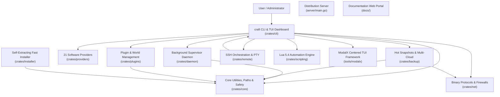

# Comprehensive Project Analysis: Craft Workspace

> **Repository**: `OguzhanUmutlu/craft`  
> **Workspace Model**: Multi-crate Rust Workspace CLI & Background Supervisor Daemon, Standalone Fast Installer, Go Distribution Server, and Documentation Portals  
> **Primary Language**: Rust (2021 Edition, MSRV 1.80+)  
> **Codebase Scale**: ~34,000+ Rust lines across 12 workspace crates (plus Go, React 18 TSX, VitePress, and Shell tooling)  
> **Current Version**: `v1.0.0`

---

## 1. Executive Overview

**Craft** is a modular, high-performance server management suite, background supervisor daemon, interactive terminal user interface (TUI) powered by ModalX, and remote orchestration engine designed for Minecraft and dedicated game servers. It bridges the gap between simple command-line wrappers and complex multi-server panels (such as Pterodactyl or AMP), packing full server lifecycle orchestration into a single native binary (<15 MB) with sub-millisecond startup times and a minimal memory footprint (<10 MB RSS for the daemon supervisor).

Craft provides end-to-end server lifecycle management across **21 server platforms** spanning Java Edition, Bedrock Edition, Proxies, and Native Game Engines (Factorio, Terraria, Palworld, Valheim, and Custom Lua/Binary engines). It features typed IPC background supervision, atomic zero-downtime hot backups, cross-platform remote orchestration over SSH, native binary protocol diagnostics (SLP, RakNet, A2S_INFO, RCON), multi-repository plugin/mod management, Zstandard-compressed caching, and an interactive TUI dashboard driven by ModalX.

---

## 2. Workspace Crate Composition and Topology

The Craft ecosystem is organized into 11 specialized Rust crates, a Go binary service, and web documentation portals:

| Layer / Crate | Path | Primary Role and Capabilities |
| :--- | :--- | :--- |
| **`craft-core`** | [`crates/core/`](../crates/core) | Filesystem isolation (`CraftPaths`), process locking (`server.lock`), dynamic Java discovery, bytecode inspection (`0xCAFEBABE`), LRU zstd artifact cache, non-destructive `TrashManager` (files & dirs), dynamic memory optimizer (`MemoryOptimizer`), multi-tenant role-based access control (`RbacRegistry`, `Role`, `Permission`, `UserAccount`), cryptographic append-only audit ledger (`AuditLedger`, HMAC-SHA256 hash chaining), pure-Rust ChaCha20-Poly1305 AEAD cipher and PBKDF2/SHA-256 (`crypto.rs`), multi-cloud storage mesh topology (`MeshRegistry`, `MeshTarget`, `MeshPolicy`), disaster recovery runbooks (`DrPlan`, `DrRunbook`), rolling time-series analysis (`RollingTimeSeries`, OLS regression, Z-score anomaly detection, TTE prediction, GC sawtooth detection), operational intelligence policies (`IntelligencePolicy`, `IntelligenceRegistry`, `intelligence.lock`), global edge mesh configuration (`EdgeRegistry`, `EdgeNode`, `GeoRoutingPolicy`, `PlayerSessionHandoff`, `CrossRegionChatEnvelope`, `BackboneCondition`, `LatencyPlaybook`, `edge.lock`), multi-cluster canary rollouts and autonomous fleet healing models (`RolloutRegistry`, `RolloutPlan`, `RolloutRecord`, `RolloutStage`, `RolloutStrategy`, `CanaryHealthCriteria`, `FleetHealthStatus`, `FleetHealingAction`, `rollouts.lock`), unified inverted log indexing and incident forensics data structures (`InvertedIndexBlock`, `LogEntry`, `LogQuery`, `LogSearchResult`, `LogLevel`, `StackFrame`, `CulpritType`, `IncidentTimeline` with HMAC-SHA256 authenticity proof, `demangle_stack_trace`), deterministic seasonal workload forecasting and cost optimization ledger (`ForecastingRegistry`, `SeasonalForecaster`, `DiurnalHourProfile`, `DayOfWeekProfile`, `CostOptimizationModel`, `CostOptimizationReport`, `ResourceTier`, `ResourceThrottlingPlan`, `WorkloadPolicy`, `forecasting.lock`), modpack CI/CD data models and atomic registry (`ModpackRegistry`, `ModpackBuildManifest`, `ModpackComponent`, `ModSide`, `BinaryDeltaHeader`, `DeltaOp`, `DeltaPatchManifest`, `modpack.lock`), zero-trust overlay mesh topology and microsegmentation data models (`SdnRegistry`, `SdnMeshConfig`, `LocalNodeConfig`, `WireguardPeer`, `IsolationZone`, `FilterProtocol`, `FilterAction`, `MicrosegmentationRule`, `MicrosegmentationPolicy`, `sdn.lock`), autonomous cgroups v2 resource isolation and fair-share scheduling models (`ServerPriority`, `ServerResourceLimit`, `TenantQuota`, `CgroupStatSnapshot`, `QuotaUsageSummary`, `CgroupV2Driver`, `QuotaRegistry`, `quotas.lock`, `~/.craft/quotas/`, `~/.craft/cgroups/`), distributed real-time tracing and OpenTelemetry models (`TraceId`, `SpanId`, `TraceContext`, `RecordedSpan`, `SpanRingBuffer`, `TraceTree`, `TraceSampler`, `OtlpJsonExporter`, `TracingConfig`, `TracingRegistry`, `tracing.lock`, `~/.craft/tracing/`), hardware-accelerated Anvil storage engine, io_uring driver and direct memory chunk cache (`AnvilConfig`, `AnvilRegistry`, `AnvilIoEngine`, `AnvilChunkCache`, `RegionFileReader`, `RegionFileWriter`, `ChunkLocation`, `anvil.lock`, `~/.craft/anvil/`, `~/.craft/cache/anvil/`), autonomous NUMA-aware topology discovery, CPU core pinning registry, hugepage management and kernel boot argument generator (`NumaTopology`, `NumaNode`, `NumaPolicy`, `NumaRegistry`, `ServerPinningConfig`, `CpuAffinityManager`, `KernelBootParams`, `numa.lock`, `~/.craft/numa/numa.toml`), Multi-Raft partitioning, joint consensus membership, and log compaction models (`MultiRaftRegistry`, `MultiRaftPartition`, `PartitionRoutingKey`, `JointConsensusPhase`, `MembershipChangeType`, `LearnerSyncProgress`, `RaftSnapshotMeta`, `SnapshotChunk`, `WalCompactionPolicy`, `multiraft.lock`, `~/.craft/raft/groups/`, `~/.craft/raft/multiraft.toml`), zero-downtime live migration models and checkpoint registry (`LiveMigrationPlan`, `MigrationStage`, `MemoryPageChunk`, `DirtyMemoryTracker`, `ServerCheckpointManifest`, `PlayerSessionDescriptor`, `AnycastRouteAnnouncement`, `AnycastRouteStatus`, `MigrationRegistry`, `migrations.lock`, `~/.craft/migrations/`, `~/.craft/migrations/migrations.toml`), autonomous eBPF kernel observability and runtime profiling models (`EbpfProbeType`, `EbpfProbeStatus`, `EbpfProbeDescriptor`, `SyscallInterceptionRecord`, `GcPhase`, `JvmGcEvent`, `ThreadContentionFrame`, `FlameGraphNode`, `EbpfRegistry`, `ebpf.lock`, `~/.craft/ebpf/`, `~/.craft/ebpf/probes.toml`), immutable cryptographic supply chain verification, in-toto Statement v1, SLSA provenance Level 3, DSSE Pre-Authentication Encoding (PAE), and RFC 6962 Rekor Merkle tree inclusion models (`InTotoStatement`, `SlsaPredicate`, `DsseEnvelope`, `SignatureEntry`, `TrustAnchor`, `SupplyChainPolicy`, `EnforcementMode`, `VerificationVerdict`, `HermeticBuildManifest`, `SupplyChainRegistry`, `RekorInclusionProof`, `supply_chain.lock`, `~/.craft/supply_chain/`), post-quantum cryptography models (`PqcAlgorithm`, `PqcKeyExchangeSuite`, `PqcRegistry`, `PqcPolicy`, `pqc.lock`, `~/.craft/pqc/`), hardware security module (HSM) abstraction, PKCS#11 v2.40/v3.0 non-extractable token keys (`CKA_EXTRACTABLE = false`), TPM 2.0 PCR bank (0–23) with AIK quoting, pure-Rust 256-bit safe prime arithmetic (`U256`) for Schnorr-Pedersen Zero-Knowledge Proof (ZKP) cluster membership validation (`HsmSlotInfo`, `HsmKeyHandle`, `HsmKeyType`, `HsmBackendType`, `PcrQuote`, `TpmPcrBank`, `ZkMembershipProof`, `ZkMembershipEngine`, `HsmEngine`, `HsmRegistry`, `hsm.lock`, `~/.craft/hsm/`), autonomous self-optimizing memory compaction orchestrator, buddy allocator fragmentation indexing (Order 0-10), transparent hugepage state, and socket page pool models (`BuddyAllocatorState`, `ThpMode`, `ThpDefragMode`, `ThpStatus`, `PagePoolConfig`, `PagePoolStats`, `CompactionStatus`, `CompactionCycleResult`, `CompactionStatusSummary`, `CompactionOrchestrator`, `CompactionRegistry`, `compaction.lock`, `~/.craft/compaction/`), autonomous eBPF XDP firewall and flow tracking models (`XdpAction`, `XdpAttachMode`, `XdpProtocol`, `XdpFilterRule`, `XdpFlowKey`, `XdpFlowState`, `XdpFlowEntry`, `XdpMapConfig`, `XdpMetricsSummary`, `XdpInterfaceStatus`, `matches_cidr`, `XdpEngine`, `XdpRegistry`, `xdp.lock`, `~/.craft/xdp/`), autonomous hardware performance counters, dynamic binary instrumentation, and cache miss profiling models (`PmuEventType`, `PmuSampleRecord`, `HotspotSymbol`, `PmuProbeStatus`, `PmuProbeConfig`, `PmuMetricsSummary`, `PmuRegistry`, `pmu.lock`, `~/.craft/pmu/`), autonomous memory-mapped persistent shared memory and ring bus (`ShmRingHeader`, `ShmSlotHeader`, `ShmSegmentConfig`, `ShmSegmentMeta`, `ShmStatusSummary`, `ShmBenchmarkMetrics`, `ShmChannelType`, `ShmRegistry`, `shm.lock`, `~/.craft/shm/`), autonomous dynamic binary rewriting, trampoline models, CFG dominance validator and page permission guard (`ArchInstructionSet`, `PatchTargetType`, `TrampolinePatchType`, `PatchState`, `TrampolineDescriptor`, `PatchManifest`, `PatchStatusSummary`, `PatchBenchmarkMetrics`, `ControlFlowGraph`, `DominanceValidator`, `PagePermissionGuard`, `PatchRegistry`, `patch.lock`, `~/.craft/patches/`), autonomous microVM sandboxing, Linux KVM ioctl models, virtio device specifications and AF_VSOCK framing (`KvmCapability`, `KvmUserMemoryRegion`, `KvmRegs`, `KvmSregs`, `KvmExitReason`, `VirtioDeviceType`, `VirtioQueue`, `VirtioDescriptor`, `VsockPacketHeader`, `VsockAddr`, `VsockOp`, `MicroVmConfig`, `MicroVmState`, `MicroVmDescriptor`, `MicroVmStatusSummary`, `MicroVmBenchmarkMetrics`, `MicroVmRegistry`, `vm.lock`, `~/.craft/vms/`), autonomous AI-guided static analysis, ELF core dump header parsing, JVM hs_err parser models, allocation tracking, leak detection candidates, and crash triage registry (`CrashType`, `CrashSeverity`, `AllocationRecord`, `LeakCandidate`, `ElfCoreDumpHeader`, `ElfCoreParsedInfo`, `JvmCrashLogParsed`, `CrashRemediationAction`, `CrashTriageReport`, `CrashTriageStatusSummary`, `CrashTriageBenchmarkMetrics`, `CrashTriageRegistry`, `crash.lock`, `~/.craft/crash/`), autonomous RDMA acceleration, InfiniBand and RoCE v2 verbs abstractions, memory region descriptors, queue pair models, and fabric registry (`RdmaTransportType`, `RdmaQpType`, `RdmaQpState`, `RdmaAccessFlags`, `MemoryRegionDescriptor`, `QueuePairConfig`, `WorkCompletionStatus`, `WorkOpcode`, `WorkCompletion`, `WorkRequest`, `RdmaLinkStatus`, `RdmaPeerEndpoint`, `RdmaStatusSummary`, `RdmaBenchmarkMetrics`, `RdmaRegistry`, `rdma.lock`, `~/.craft/rdma/`), autonomous eBPF XDP hardware offloading, SmartNIC vendor descriptors, P4 match-action table structures, TCAM allocation tracking, and offload registry (`SmartNicVendor`, `OffloadMode`, `OffloadProtocol`, `P4MatchField`, `P4ActionType`, `P4TableEntry`, `P4MatchActionTable`, `SmartNicDeviceInfo`, `SmartNicOffloadRule`, `SmartNicStatusSummary`, `SmartNicBenchmarkMetrics`, `SmartNicRegistry`, `smartnic.lock`, `~/.craft/smartnic/`), autonomous geo-distributed Byzantine fault-tolerant consensus, aggregate BLS signatures, zero-knowledge recursive state transition proofs, and slashing models (`BftNodeRole`, `BftPhase`, `BftTxType`, `SlashingReason`, `BftTransaction`, `QuorumCertificate`, `BftBlock`, `BlsPublicKey`, `BlsSignature`, `BlsAggregateSignature`, `BlsKeypair`, `ZkStateProof`, `RecursiveStateAttestation`, `ZkStateProver`, `SlashingEvidence`, `SlashingVerdict`, `BftValidator`, `BftStatusSummary`, `BftBenchmarkMetrics`, `BftRegistry`, `bft.lock`, `~/.craft/bft/`, `~/.craft/bft/proofs/`), autonomous eBPF-driven kernel scheduling telemetry, micro-stall detection, real-time FIFO priority escalation, and CPU jitter elimination models (`SchedTracepointType`, `SchedPolicy`, `MicroStallCause`, `MicroStallEvent`, `PriorityInversionRecord`, `IrqStormDescriptor`, `JitterMitigationConfig`, `JitterStatusSummary`, `JitterBenchmarkMetrics`, `JitterRegistry`, `jitter.lock`, `~/.craft/jitter/`), autonomous neuromorphic AI tick scheduling, Leaky Integrate-and-Fire (LIF) models, STDP plasticity rules, and spike loop descriptors (`NeuronModelType`, `LifNeuron`, `SpikeEvent`, `SpikeSourceType`, `SynapseConfig`, `StdpConfig`, `StdpLearningRule`, `NeuromorphicScheduleMode`, `NeuromorphicStatusSummary`, `NeuromorphicBenchmarkMetrics`, `NeuromorphicRegistry`, `neuromorphic.lock`, `~/.craft/neuromorphic/`, `~/.craft/neuromorphic/models/`), autonomous optical network switching, DWDM ITU-T grid specifications, MEMS micro-mirror deflection states, optical circuit lightpaths, routing modes, status summaries, benchmark metrics, and advisory locking (`OpticalWavelength`, `PhotonicPort`, `MemsMirrorState`, `OpticalCircuit`, `OpticalSwitchTopology`, `OpticalRoutingMode`, `OpticalStatusSummary`, `OpticalBenchmarkMetrics`, `OpticalRegistry`, `optical.lock`, `~/.craft/optical/`), autonomous sub-atomic quantum clock synchronization, Precision Time Protocol (IEEE 1588 PTP) hardware timestamping, TrueTime uncertainty bounds ($\epsilon$), causality vector clocks, plain-text status renderers, and advisory locking (`ClockClass`, `ClockAccuracy`, `PtpPortRole`, `ClockServoMode`, `TrueTimeInterval`, `CausalityVectorClock`, `PtpPeer`, `PtpStatusSummary`, `PtpBenchmarkMetrics`, `PtpRegistry`, `ptp.lock`, `~/.craft/ptp/`), transactional registries (`ServersRegistry`, `AutoscaleRegistry`, `RemotesRegistry`, `GlobalBackupRegistry`, `ClustersRegistry`, `WebhooksRegistry`), properties parsing. |
| **`craft-providers`** | [`crates/providers/`](../crates/providers) | 21 server platforms across Java, Bedrock, Proxies, and Native games. Dynamic software provider loader (`craft.custom.toml`), asset resolution, automated GC tuning profiles (`--aikar`, `--zgc`, `--shenandoah`), in-memory embedded fallback catalogs. |
| **`craft-daemon`** | [`crates/daemon/`](../crates/daemon) | Detached background supervisor process, typed IPC over Unix sockets (`daemon.sock`) and Named Pipes (`\\.\pipe\craft-daemon`), 50k-line circular log ring buffer, stdin command injection, OS service unit generation, Prometheus `/metrics` exposition, event-driven webhooks (`Discord`, `Slack`, `GenericJson`), authenticated WebSocket console gateway, embedded zero-dependency Web Dashboard SPA (`DASHBOARD_HTML`) & REST API (`/api/auth`, `/api/servers`, `/api/audit`, `/api/rbac`, `/api/ai`, `/api/edge`), background storage monitor, idle hibernation manager (`HibernationManager`), in-process `EdgeStateBroker` (single-use player session handoff tokens, HMAC cross-region chat, dynamic playbook executor), autonomous intelligence autopilot (`AutopilotEngine`), real-time `TickService` background telemetry coordinator, autonomous `FleetHealer` background evaluation loop (canary bake observation, automated snapshot rollback restoration, node self-healing), embedded zero-dependency log indexer and ingestion service (`LogIngestionService`, 5,000-line `InvertedIndexBlock` chunk writer, active buffer ring, incident post-mortem recording), in-process predictive workload forecasting and cost optimization engine (`WorkloadForecastingService`, seasonal diurnal curve fitting, proactive wake schedules ahead of surges, quiet-hour hibernation downscaling), high-throughput modpack distribution service (`ModpackDistributionService`, RFC 7233 partial HTTP `Range: bytes=X-Y` streaming, binary delta deployment), in-process SDN overlay supervisor (`SdnService`), in-process resource quota supervisor (`QuotaService`), in-process distributed tracing supervisor (`TracingService`), in-process hardware-accelerated Anvil storage service (`AnvilService`), in-process DPDK packet engine and NUMA supervisor (`DpdkNumaService`), in-process Multi-Raft and compaction service (`MultiRaftService`), in-process live migration coordinator and anycast supervisor (`MigrationService`), in-process eBPF observability service (`EbpfObservabilityService`), in-process supply chain verification & hermetic build service (`SupplyChainService`), in-process post-quantum cryptography service (`PqcService`), in-process hardware security module service (`HsmService`), in-process memory compaction and transparent hugepage supervisor (`CompactionService`), in-process autonomous eBPF XDP firewall and flow tracking service (`XdpService`), in-process autonomous PMU hardware performance counter supervisor (`PmuService`), in-process POSIX shared memory service (`ShmService`), in-process dynamic binary rewriting supervisor (`DynamicPatchService`), in-process microVM supervisor (`MicroVmService`), in-process autonomous crash triage & leak detection service (`CrashTriageService`), in-process autonomous RDMA network acceleration service (`RdmaService`), in-process autonomous SmartNIC hardware offloading & P4 switching service (`SmartNicService`), in-process autonomous Byzantine fault-tolerant consensus service (`BftConsensusService`), in-process autonomous kernel jitter mitigation service (`JitterMitigationService`), in-process autonomous neuromorphic AI tick scheduling & spike-driven game loop inference service (`NeuromorphicService`), in-process autonomous optical network switching & photonic interconnect supervisor (`OpticalSwitchService`), and in-process autonomous PTP clock synchronization & TrueTime supervisor (`PtpClockService`, discrete PI servo mode transitions, TrueTime interval generation, phase stepping, 24h cosine leap-second smearing, Prometheus metrics `craft_ptp_*`, typed IPC for `PtpGetStatus`, `PtpSetServoMode`, `PtpQueryTrueTime`, `PtpStepServo`, `PtpTriggerLeapSecondSmear`, `PtpRunBench`, `PtpResetMetrics`). |
| **`craft-net`** | [`crates/net/`](../crates/net) | Pure Rust networking protocols: Java SLP (TCP VarInt handshake), Bedrock RakNet (UDP 0x01), Valve A2S_INFO query, async RCON client, pure-Rust TCP `SleepProxy`, host firewall automation, RoCE v2 RDMA verbs, SmartNIC P4 offload tables, inter-server memory fabric and remote paging, pure-Rust NVMe-oF target wire framing (`NvmeCommandCapsule`, `NvmeCompletionCapsule`, `NvmeConnectPayload`, `FlashBlockPoolEngine`, `NvmeTargetEngine`, `benchmark_nvme_fabric`), pure-Rust HotStuff chained BFT consensus state machine (`HotStuffBftEngine`), aggregate BLS signatures, zero-knowledge recursive state transition prover (`ZkStateProver`), pure-Rust kernel scheduling telemetry ingestion (`RawPerfSample`, `PerfEventRingBuffer`), logarithmic micro-histograms in `KernelSchedTracer`, core affinity shielding and IRQ rebalancing in `MicroStallScheduler`, pure-Rust asynchronous event spike queue (`SpikeQueue`), cache-aligned SIMD synaptic weight matrix (`SynapseMatrix`), 3-layer recurrent SNN (`SpikeNeuralNetwork`), pure-Rust binary optical frame wire encapsulation (`OpticalWaveguideFrame` with `OPT1` magic), non-blocking $N \times N$ MEMS crossbar simulation engine (`MemsCrossbarSwitch`), DWDM wavelength multiplexer (`WdmMultiplexer`), and pure-Rust binary IEEE 1588 PTP wire framing (`PtpHeader`, `PtpTimestamp`, `PtpSyncPacket`, `PtpFollowUpPacket`, `PtpDelayReqPacket`, `PtpDelayRespPacket` with `PTP1` magic `0x50545031`), discrete PI `PtpClockServo` with frequency slew clamping ($\pm 500\text{ ppm}$), `TrueTimeEngine` with dynamic uncertainty expansion, and synthetic benchmark `benchmark_ptp_clock_sync`. |
| **`craft-plugins`** | [`crates/plugins/`](../crates/plugins) | Unified plugin and mod search across Modrinth, Hangar, and Poggit; universal modpack distribution engine (`modpack`); in-memory bytecode JAR manifest extraction; semantic compatibility verification; recursive dependency resolution; SHA-512 update checker with atomic upgrades; universal community map resolver; NBT player data inspection, dimension management; automated modpack CI/CD builder; and pure-Rust block-level binary delta engine. |
| **`craft-backup`** | [`crates/backup/`](../crates/backup) | Zero-downtime RCON-synchronized hot backups, atomic tar.gz / tar.zst archiving, selective world backups (`--world-only`), local retention enforcement, AWS S3 SigV4 HMAC-SHA256, Google Drive OAuth2 REST integration, Fast Content-Defined Chunking (`FastCDC`), Content-Addressed Storage pool (`ChunkStore`), Merkle tree root hashing, multi-cloud `StorageMesh` replication coordinator, and automated disaster recovery simulator. |
| **`craft-remote`** | [`crates/remote/`](../crates/remote) | Multi-node SSH connection pooling, SFTP bidirectional synchronization, interactive remote PTY proxy, tri-platform remote host bootstrapping, federated cluster operations, federated NVMe-oF target storage fabric operations, federated BFT consensus and quorum operations, federated kernel jitter mitigation operations, federated neuromorphic tick scheduling and SNN inference operations, federated optical network switching and lightpath operations, and federated PTP clock synchronization and TrueTime operations (`RemoteCraftClient::get_remote_ptp_status`, `set_remote_ptp_servo_mode`, `query_remote_ptp_truetime`, `step_remote_ptp_servo`, `trigger_remote_ptp_leap_smear`, `run_remote_ptp_bench`, `reset_remote_ptp_metrics`). |
| **`craft-scripting`** | [`crates/scripting/`](../crates/scripting) | Embedded Lua 5.4 engine (`mlua`) with sandboxed execution, deadline instruction hooks, `craft.*` stdlib, and event-driven lifecycle hook bus (`HookBus`) supporting 4 BFT consensus lifecycle events, 4 kernel jitter elimination lifecycle events, 4 neuromorphic AI tick scheduling lifecycle events, 4 optical network switching lifecycle events, and 4 PTP clock synchronization lifecycle events (`LifecycleEvent::PtpClockSynchronized`, `PtpClockDriftExceeded`, `PtpTrueTimeWindowAdjusted`, `PtpLeapSecondSmeared`) with contextual timing and uncertainty telemetry. |
| **`modalx`** | [`tools/modalx/`](../tools/modalx) | Standalone centered TUI modal framework, bounded box frames with display column width calculations (`unicode-width`), `TextInput` readline engine, navigation guards, zero-emoji aesthetic. |
| **`craft-cli`** | [`crates/cli/`](../crates/cli) | Main CLI entrypoint, 132 command handlers including Autonomous Sub-Atomic Quantum Clock Synchronization, PTP Hardware Timestamping & Relativity-Aware Tick Sequencing (`craft ptp status`, `craft ptp mode`, `craft ptp truetime`, `craft ptp step`, `craft ptp leap-smear`, `craft ptp bench`, `craft ptp reset-metrics` with aliases `clock`, `truetime`, `timesync`, `1588`), Autonomous Optical Network Switching (`craft optical`), Autonomous Neuromorphic AI Tick Scheduling (`craft neuromorphic`), Autonomous eBPF-Driven Live Game Kernel Tracing (`craft jitter`), Autonomous Geo-Distributed Byzantine Fault-Tolerant Consensus (`craft bft`), Autonomous Quantum-Encrypted Inter-Cluster VPN Mesh (`craft vpn`), Autonomous Zero-Copy Storage Fabrics (`craft nvme`), Autonomous Distributed Memory Fabric (`craft memfabric`), Autonomous SmartNIC Acceleration & P4 Switching (`craft smartnic`), Autonomous RDMA Network Acceleration (`craft rdma`), and interactive ModalX centered TUI dialogs. |

| **`craft-ui`** | [`crates/ui/`](../crates/ui) | Native Desktop GUI Studio built with Tauri v2, React 18, TypeScript TSX, PostCSS, and Vite. Exposes full fleet controls, live console virtualization, JFR diagnostics hub, edge latency probers, multi-cloud storage mesh inspection, and cryptographic audit ledger. |
| **`craft-installer`** | [`crates/installer/`](../crates/installer) | Ultra-fast standalone self-extracting installer (<35ms install time) with embedded zstd decompression and PATH configuration. |
| **Distribution Server** | [`server/`](../server) | Concurrent Go HTTP server with SHA-256 caching and dynamic install script templating (`install.sh`, `install.ps1`). |
| **Documentation Portals**| [`docs/`](../docs) | React 18 / Vite 6 portal and VitePress documentation suite in `tools/modalx/docs/`. |

---

## 3. Specialized Domain Skill Modules

To maintain deep technical excellence without cluttering high-level documentation, specialized domain knowledge is maintained within individual skill modules under `analysis/`. Each module contains a comprehensive `SKILL.md` detailing implementation rules, algorithms, data contracts, and operational guidelines:

1. **Architecture & Core Mechanics**: [`analysis/architecture/SKILL.md`](./architecture/SKILL.md)  
   Crate dependency boundaries, transactional registry serialization, inter-process locking (`raft.lock`, `memfabric.lock`, `nvme.lock`, `vpn.lock`, `bft.lock`, `jitter.lock`, `neuromorphic.lock`, `optical.lock`, `ptp.lock`), path resolution, pure-Rust Raft consensus state machine (`RaftEngine`), write-ahead log replication (`raft.wal`), dynamic split-brain arbitration, sub-microsecond RDMA verbs, SmartNIC P4 offload tables, distributed inter-server memory fabric (`RemotePagingEngine`), transparent userfaultfd dimension paging, zero-copy NVMe-oF target storage fabrics (`FlashBlockPoolEngine`, `NvmeTargetEngine`), quantum-encrypted inter-cluster WireGuard PQXDH VPN mesh (`PqxdhEngine`, `SmartNicCryptoOffloadEngine`, `WireGuardMeshEngine`), autonomous geo-distributed Byzantine fault-tolerant consensus (`HotStuffBftEngine`, aggregate BLS signatures, `ZkStateProver` recursive proofs), autonomous eBPF kernel sched tracing, FIFO priority escalation, and real-time CPU jitter elimination (`KernelSchedTracer`, `MicroStallScheduler`, `PerfEventRingBuffer`), autonomous neuromorphic AI tick scheduling, spike-driven game loop inference, Leaky Integrate-and-Fire (LIF) neurons, and STDP synaptic plasticity (`SpikeNeuralNetwork`, `SpikeQueue`, `SynapseMatrix`, `NeuromorphicService`), autonomous optical network switching, MEMS crossbar switching, DWDM wavelength allocation, and sub-10ns photonic waveguide routing (`MemsCrossbarSwitch`, `WdmMultiplexer`, `OpticalSwitchService`), and autonomous sub-atomic quantum clock synchronization, IEEE 1588 PTP hardware timestamping, discrete PI clock servo frequency slew clamping, and TrueTime relativity uncertainty bounds (`PtpClockServo`, `TrueTimeEngine`, `PtpClockService`).

2. **Daemon & Background Supervision**: [`analysis/daemon-supervision/SKILL.md`](./daemon-supervision/SKILL.md)  
   IPC protocols, circular ring buffer management, stdin streaming, service unit templating, detached process supervision, autonomous operational intelligence (`AutopilotEngine`), and `TickService` telemetry coordinator.
3. **Protocols & Networking Security**: [`analysis/protocols-networking/SKILL.md`](./protocols-networking/SKILL.md)  
   VarInt framing, RakNet packet decoding, Valve A2S_INFO query, async RCON client, programmatic OS firewall provisioning, logarithmic latency micro-histograms (`LatencyHistogram`), real-time MSPT tick profiling (`TickProfiler`), and Netty packet inspection (`NettyPacketInspector`).
4. **Backup Systems & Resilience**: [`analysis/backup-resilience/SKILL.md`](./backup-resilience/SKILL.md)  
   RCON-synchronized save flushes, atomic compression, S3 Signature Version 4 HMAC, Google Drive integration, and restore concurrency guards.
5. **Software Providers & Multi-Engine Parity**: [`analysis/software-providers/SKILL.md`](./software-providers/SKILL.md)  
   21 server engine specifications, dynamic TOML definition packages, bytecode inspection, GC profiles, and multi-game support.
6. **UI/UX & Terminal Modals (ModalX)**: [`analysis/uiux-tui/SKILL.md`](./uiux-tui/SKILL.md)  
   Centered bounded box rendering, `unicode-width` border alignment, readline `TextInput` keybindings, and virtual seek-based log streaming.
7. **Security, Diagnostics & Data Safety**: [`analysis/security-safety/SKILL.md`](./security-safety/SKILL.md)  
   Process lock guards, non-destructive `TrashManager` (files and directories), diagnostic self-healing (`craft fix`), EULA enforcement, and autonomous Linux cgroups v2 resource isolation (`CgroupV2Driver`, hard memory quotas, CFS CPU quotas, and fair-share scheduling arbitration).
8. **Desktop Studio & Systems Design (UI/UX)**: [`analysis/uiux/SKILL.md`](./uiux/SKILL.md)  
   Spatial grid tokens (4px/8px), WCAG AAA dark slate color matrix, monospace-first typography scale, live console virtualization, and headless CDP DevTools automation.
9. **Scripting, Headless Automation & Lifecycle Hooks**: [`analysis/scripting-automation/SKILL.md`](./scripting-automation/SKILL.md)  
   Embedded Lua 5.4 VM, execution deadline hooks, expanded stdlib (`craft.servers`, `craft.backup`, `craft.net`, `craft.http`, `craft.audit`), event-driven lifecycle hook bus, and headless CLI runner.

---

## 4. Multi-Repository Assessment

- **Current Repository Model**: Craft operates as a unified Cargo workspace containing 12 crates.
- **Standalone Evaluation**:
  - `tools/modalx` is already decoupled into its own standalone Git repository (`git@github.com:OguzhanUmutlu/modalx.git`) and published separately to crates.io (`modalx = "0.1.3"`), while remaining synchronized in the workspace for atomic co-development.
  - All other crates (`craft-core`, `craft-providers`, `craft-daemon`, `craft-net`, `craft-plugins`, `craft-backup`, `craft-remote`, `craft-scripting`, `craft-installer`, `craft-cli`, `craft-ui`) share deep domain interdependencies and benefits from the mono-workspace model.
  - Splitting the remaining crates into separate repositories is **not recommended** at this time, as single-workspace atomic builds guarantee ABI parity and prevent dependency drift.
