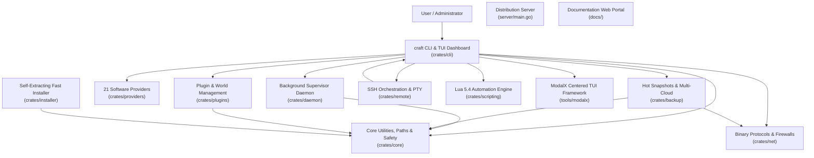

# Comprehensive Project Analysis: Craft Workspace

> **Repository**: `OguzhanUmutlu/craft`  
> **Workspace Model**: Multi-crate Rust Workspace CLI & Background Supervisor Daemon, Standalone Fast Installer, Go Distribution Server, and Documentation Portals  
> **Primary Language**: Rust (2021 Edition, MSRV 1.80+)  
> **Codebase Scale**: ~34,000+ Rust lines across 12 workspace crates (plus Go, React 18 TSX, VitePress, and Shell tooling)  
> **Current Version**: `v1.0.0`

---

## 1. Executive Overview

**Craft** is a modular, high-performance server management suite, background supervisor daemon, interactive terminal user interface (TUI) powered by ModalX, and remote orchestration engine designed for Minecraft and dedicated game servers. It bridges the gap between simple command-line wrappers and complex multi-server panels (such as Pterodactyl or AMP), packing full server lifecycle orchestration into a single native binary (<15 MB) with sub-millisecond startup times and a minimal memory footprint (<10 MB RSS for the daemon supervisor).

Craft provides end-to-end server lifecycle management across **21 server platforms** spanning Java Edition, Bedrock Edition, Proxies, and Native Game Engines (Factorio, Terraria, Palworld, Valheim, and Custom Lua/Binary engines). It features typed IPC background supervision, atomic zero-downtime hot backups, cross-platform remote orchestration over SSH, native binary protocol diagnostics (SLP, RakNet, A2S_INFO, RCON), multi-repository plugin/mod management, Zstandard-compressed caching, and an interactive TUI dashboard driven by ModalX.

---

## 2. Workspace Crate Composition and Topology

The Craft ecosystem is organized into 11 specialized Rust crates, a Go binary service, and web documentation portals:

| Layer / Crate | Path | Primary Role and Capabilities |
| :--- | :--- | :--- |
| **`craft-core`** | [`crates/core/`](../crates/core) | Filesystem isolation (`CraftPaths`), process locking (`server.lock`), dynamic Java discovery, bytecode inspection (`0xCAFEBABE`), LRU zstd artifact cache, non-destructive `TrashManager` (files & dirs), dynamic memory optimizer (`MemoryOptimizer`), multi-tenant role-based access control (`RbacRegistry`, `Role`, `Permission`, `UserAccount`), cryptographic append-only audit ledger (`AuditLedger`, HMAC-SHA256 hash chaining), pure-Rust ChaCha20-Poly1305 AEAD cipher and PBKDF2/SHA-256 (`crypto.rs`), multi-cloud storage mesh topology (`MeshRegistry`, `MeshTarget`, `MeshPolicy`), disaster recovery runbooks (`DrPlan`, `DrRunbook`), rolling time-series analysis (`RollingTimeSeries`, OLS regression, Z-score anomaly detection, TTE prediction, GC sawtooth detection), operational intelligence policies (`IntelligencePolicy`, `IntelligenceRegistry`, `intelligence.lock`), global edge mesh configuration (`EdgeRegistry`, `EdgeNode`, `GeoRoutingPolicy`, `PlayerSessionHandoff`, `CrossRegionChatEnvelope`, `BackboneCondition`, `LatencyPlaybook`, `edge.lock`), multi-cluster canary rollouts and autonomous fleet healing models (`RolloutRegistry`, `RolloutPlan`, `RolloutRecord`, `RolloutStage`, `RolloutStrategy`, `CanaryHealthCriteria`, `FleetHealthStatus`, `FleetHealingAction`, `rollouts.lock`), unified inverted log indexing and incident forensics data structures (`InvertedIndexBlock`, `LogEntry`, `LogQuery`, `LogSearchResult`, `LogLevel`, `StackFrame`, `CulpritType`, `IncidentTimeline` with HMAC-SHA256 authenticity proof, `demangle_stack_trace`), deterministic seasonal workload forecasting and cost optimization ledger (`ForecastingRegistry`, `SeasonalForecaster`, `DiurnalHourProfile`, `DayOfWeekProfile`, `CostOptimizationModel`, `CostOptimizationReport`, `ResourceTier`, `ResourceThrottlingPlan`, `WorkloadPolicy`, `forecasting.lock`), modpack CI/CD data models and atomic registry (`ModpackRegistry`, `ModpackBuildManifest`, `ModpackComponent`, `ModSide`, `BinaryDeltaHeader`, `DeltaOp`, `DeltaPatchManifest`, `modpack.lock`), zero-trust overlay mesh topology and microsegmentation data models (`SdnRegistry`, `SdnMeshConfig`, `LocalNodeConfig`, `WireguardPeer`, `IsolationZone`, `FilterProtocol`, `FilterAction`, `MicrosegmentationRule`, `MicrosegmentationPolicy`, `sdn.lock`), autonomous cgroups v2 resource isolation and fair-share scheduling models (`ServerPriority`, `ServerResourceLimit`, `TenantQuota`, `CgroupStatSnapshot`, `QuotaUsageSummary`, `CgroupV2Driver`, `QuotaRegistry`, `quotas.lock`, `~/.craft/quotas/`, `~/.craft/cgroups/`), distributed real-time tracing and OpenTelemetry models (`TraceId`, `SpanId`, `TraceContext`, `RecordedSpan`, `SpanRingBuffer`, `TraceTree`, `TraceSampler`, `OtlpJsonExporter`, `TracingConfig`, `TracingRegistry`, `tracing.lock`, `~/.craft/tracing/`), hardware-accelerated Anvil storage engine, io_uring driver and direct memory chunk cache (`AnvilConfig`, `AnvilRegistry`, `AnvilIoEngine`, `AnvilChunkCache`, `RegionFileReader`, `RegionFileWriter`, `ChunkLocation`, `anvil.lock`, `~/.craft/anvil/`, `~/.craft/cache/anvil/`), autonomous NUMA-aware topology discovery, CPU core pinning registry, hugepage management and kernel boot argument generator (`NumaTopology`, `NumaNode`, `NumaPolicy`, `NumaRegistry`, `ServerPinningConfig`, `CpuAffinityManager`, `KernelBootParams`, `numa.lock`, `~/.craft/numa/numa.toml`), Multi-Raft partitioning, joint consensus membership, and log compaction models (`MultiRaftRegistry`, `MultiRaftPartition`, `PartitionRoutingKey`, `JointConsensusPhase`, `MembershipChangeType`, `LearnerSyncProgress`, `RaftSnapshotMeta`, `SnapshotChunk`, `WalCompactionPolicy`, `multiraft.lock`, `~/.craft/raft/groups/`, `~/.craft/raft/multiraft.toml`), zero-downtime live migration models and checkpoint registry (`LiveMigrationPlan`, `MigrationStage`, `MemoryPageChunk`, `DirtyMemoryTracker`, `ServerCheckpointManifest`, `PlayerSessionDescriptor`, `AnycastRouteAnnouncement`, `AnycastRouteStatus`, `MigrationRegistry`, `migrations.lock`, `~/.craft/migrations/`, `~/.craft/migrations/migrations.toml`), autonomous eBPF kernel observability and runtime profiling models (`EbpfProbeType`, `EbpfProbeStatus`, `EbpfProbeDescriptor`, `SyscallInterceptionRecord`, `GcPhase`, `JvmGcEvent`, `ThreadContentionFrame`, `FlameGraphNode`, `EbpfRegistry`, `ebpf.lock`, `~/.craft/ebpf/`, `~/.craft/ebpf/probes.toml`), immutable cryptographic supply chain verification, in-toto Statement v1, SLSA provenance Level 3, DSSE Pre-Authentication Encoding (PAE), and RFC 6962 Rekor Merkle tree inclusion models (`InTotoStatement`, `SlsaPredicate`, `DsseEnvelope`, `SignatureEntry`, `TrustAnchor`, `SupplyChainPolicy`, `EnforcementMode`, `VerificationVerdict`, `HermeticBuildManifest`, `SupplyChainRegistry`, `RekorInclusionProof`, `supply_chain.lock`, `~/.craft/supply_chain/`), post-quantum cryptography models (`PqcAlgorithm`, `PqcKeyExchangeSuite`, `PqcRegistry`, `PqcPolicy`, `pqc.lock`, `~/.craft/pqc/`), hardware security module (HSM) abstraction, PKCS#11 v2.40/v3.0 non-extractable token keys (`CKA_EXTRACTABLE = false`), TPM 2.0 PCR bank (0–23) with AIK quoting, pure-Rust 256-bit safe prime arithmetic (`U256`) for Schnorr-Pedersen Zero-Knowledge Proof (ZKP) cluster membership validation (`HsmSlotInfo`, `HsmKeyHandle`, `HsmKeyType`, `HsmBackendType`, `PcrQuote`, `TpmPcrBank`, `ZkMembershipProof`, `ZkMembershipEngine`, `HsmEngine`, `HsmRegistry`, `hsm.lock`, `~/.craft/hsm/`), autonomous self-optimizing memory compaction orchestrator, buddy allocator fragmentation indexing (Order 0-10), transparent hugepage state, and socket page pool models (`BuddyAllocatorState`, `ThpMode`, `ThpDefragMode`, `ThpStatus`, `PagePoolConfig`, `PagePoolStats`, `CompactionStatus`, `CompactionCycleResult`, `CompactionStatusSummary`, `CompactionOrchestrator`, `CompactionRegistry`, `compaction.lock`, `~/.craft/compaction/`), autonomous eBPF XDP firewall and flow tracking models (`XdpAction`, `XdpAttachMode`, `XdpProtocol`, `XdpFilterRule`, `XdpFlowKey`, `XdpFlowState`, `XdpFlowEntry`, `XdpMapConfig`, `XdpMetricsSummary`, `XdpInterfaceStatus`, `matches_cidr`, `XdpEngine`, `XdpRegistry`, `xdp.lock`, `~/.craft/xdp/`), autonomous hardware performance counters, dynamic binary instrumentation, and cache miss profiling models (`PmuEventType`, `PmuSampleRecord`, `HotspotSymbol`, `PmuProbeStatus`, `PmuProbeConfig`, `PmuMetricsSummary`, `PmuRegistry`, `pmu.lock`, `~/.craft/pmu/`), autonomous memory-mapped persistent shared memory and ring bus (`ShmRingHeader`, `ShmSlotHeader`, `ShmSegmentConfig`, `ShmSegmentMeta`, `ShmStatusSummary`, `ShmBenchmarkMetrics`, `ShmChannelType`, `ShmRegistry`, `shm.lock`, `~/.craft/shm/`), autonomous dynamic binary rewriting, trampoline models, CFG dominance validator and page permission guard (`ArchInstructionSet`, `PatchTargetType`, `TrampolinePatchType`, `PatchState`, `TrampolineDescriptor`, `PatchManifest`, `PatchStatusSummary`, `PatchBenchmarkMetrics`, `ControlFlowGraph`, `DominanceValidator`, `PagePermissionGuard`, `PatchRegistry`, `patch.lock`, `~/.craft/patches/`), autonomous microVM sandboxing, Linux KVM ioctl models, virtio device specifications and AF_VSOCK framing (`KvmCapability`, `KvmUserMemoryRegion`, `KvmRegs`, `KvmSregs`, `KvmExitReason`, `VirtioDeviceType`, `VirtioQueue`, `VirtioDescriptor`, `VsockPacketHeader`, `VsockAddr`, `VsockOp`, `MicroVmConfig`, `MicroVmState`, `MicroVmDescriptor`, `MicroVmStatusSummary`, `MicroVmBenchmarkMetrics`, `MicroVmRegistry`, `vm.lock`, `~/.craft/vms/`), autonomous AI-guided static analysis, ELF core dump header parsing, JVM hs_err parser models, allocation tracking, leak detection candidates, and crash triage registry (`CrashType`, `CrashSeverity`, `AllocationRecord`, `LeakCandidate`, `ElfCoreDumpHeader`, `ElfCoreParsedInfo`, `JvmCrashLogParsed`, `CrashRemediationAction`, `CrashTriageReport`, `CrashTriageStatusSummary`, `CrashTriageBenchmarkMetrics`, `CrashTriageRegistry`, `crash.lock`, `~/.craft/crash/`), autonomous RDMA acceleration, InfiniBand and RoCE v2 verbs abstractions, memory region descriptors, queue pair models, and fabric registry (`RdmaTransportType`, `RdmaQpType`, `RdmaQpState`, `RdmaAccessFlags`, `MemoryRegionDescriptor`, `QueuePairConfig`, `WorkCompletionStatus`, `WorkOpcode`, `WorkCompletion`, `WorkRequest`, `RdmaLinkStatus`, `RdmaPeerEndpoint`, `RdmaStatusSummary`, `RdmaBenchmarkMetrics`, `RdmaRegistry`, `rdma.lock`, `~/.craft/rdma/`), autonomous eBPF XDP hardware offloading, SmartNIC vendor descriptors, P4 match-action table structures, TCAM allocation tracking, and offload registry (`SmartNicVendor`, `OffloadMode`, `OffloadProtocol`, `P4MatchField`, `P4ActionType`, `P4TableEntry`, `P4MatchActionTable`, `SmartNicDeviceInfo`, `SmartNicOffloadRule`, `SmartNicStatusSummary`, `SmartNicBenchmarkMetrics`, `SmartNicRegistry`, `smartnic.lock`, `~/.craft/smartnic/`), transactional registries (`ServersRegistry`, `AutoscaleRegistry`, `RemotesRegistry`, `GlobalBackupRegistry`, `ClustersRegistry`, `WebhooksRegistry`), properties parsing. |
| **`craft-providers`** | [`crates/providers/`](../crates/providers) | 21 server platforms across Java, Bedrock, Proxies, and Native games. Dynamic software provider loader (`craft.custom.toml`), asset resolution, automated GC tuning profiles (`--aikar`, `--zgc`, `--shenandoah`), in-memory embedded fallback catalogs. |
| **`craft-daemon`** | [`crates/daemon/`](../crates/daemon) | Detached background supervisor process, typed IPC over Unix sockets (`daemon.sock`) and Named Pipes (`\\.\pipe\craft-daemon`), 50k-line circular log ring buffer, stdin command injection, OS service unit generation, Prometheus `/metrics` exposition, event-driven webhooks (`Discord`, `Slack`, `GenericJson`), authenticated WebSocket console gateway, embedded zero-dependency Web Dashboard SPA (`DASHBOARD_HTML`) & REST API (`/api/auth`, `/api/servers`, `/api/audit`, `/api/rbac`, `/api/ai`, `/api/edge`), background storage monitor, idle hibernation manager (`HibernationManager`), in-process `EdgeStateBroker` (single-use player session handoff tokens, HMAC cross-region chat, dynamic playbook executor), autonomous intelligence autopilot (`AutopilotEngine`), real-time `TickService` background telemetry coordinator, autonomous `FleetHealer` background evaluation loop (canary bake observation, automated snapshot rollback restoration, node self-healing), embedded zero-dependency log indexer and ingestion service (`LogIngestionService`, 5,000-line `InvertedIndexBlock` chunk writer, active buffer ring, incident post-mortem recording), in-process predictive workload forecasting and cost optimization engine (`WorkloadForecastingService`, seasonal diurnal curve fitting, proactive wake schedules ahead of surges, quiet-hour hibernation downscaling), high-throughput modpack distribution service (`ModpackDistributionService`, RFC 7233 partial HTTP `Range: bytes=X-Y` streaming, binary delta deployment), in-process SDN overlay supervisor (`SdnService`), in-process resource quota supervisor (`QuotaService`), in-process distributed tracing supervisor (`TracingService`), in-process hardware-accelerated Anvil storage service (`AnvilService`), in-process DPDK packet engine and NUMA supervisor (`DpdkNumaService`), in-process Multi-Raft and compaction service (`MultiRaftService`), in-process live migration coordinator and anycast supervisor (`MigrationService`), in-process eBPF observability service (`EbpfObservabilityService`), in-process supply chain verification & hermetic build service (`SupplyChainService`), in-process post-quantum cryptography service (`PqcService`), in-process hardware security module service (`HsmService`), in-process memory compaction and transparent hugepage supervisor (`CompactionService`), in-process autonomous eBPF XDP firewall and flow tracking service (`XdpService`), in-process autonomous PMU hardware performance counter supervisor (`PmuService`), in-process POSIX shared memory service (`ShmService`), in-process dynamic binary rewriting supervisor (`DynamicPatchService`), in-process microVM supervisor (`MicroVmService`), in-process autonomous crash triage & leak detection service (`CrashTriageService`), in-process autonomous RDMA network acceleration service (`RdmaService`), and in-process autonomous SmartNIC hardware offloading & P4 switching service (`SmartNicService`, rule installation, TCAM capacity tracking, benchmark sweeps, fallback driver bridging, Prometheus metrics `craft_smartnic_*`, typed IPC for `SmartNicGetStatus`, `SmartNicInstallRule`, `SmartNicRemoveRule`, `SmartNicListRules`, `SmartNicRunBench`, `SmartNicResetMetrics`). |
| **`craft-net`** | [`crates/net/`](../crates/net) | Pure Rust networking protocols: Java SLP (TCP VarInt handshake), Bedrock RakNet (UDP 0x01), Valve A2S_INFO query, async RCON client, pure-Rust TCP `SleepProxy` (sleeping MOTD, login packet wake), host firewall automation (iptables, UFW, netsh, pfctl), Windows UWP loopback exemption, multi-sample TCP edge latency prober with jitter and packet loss calculation (`EdgeLatencyProber`), dynamic edge proxy routing configuration generation and traffic draining (`EdgeRouteGenerator`), bounded-memory logarithmic latency micro-histograms (`LatencyHistogram`, 72 buckets, $O(1)$ insertion, quantile interpolation), sliding-window tick profiler (`TickProfiler`), Netty packet inspector (`NettyPacketInspector`), WireGuard keypair generation and multi-platform configuration synthesis (`WgConfigGenerator`), pure-Rust userspace eBPF packet filtering and rate limiters (`PacketFilterEngine`), mutual TLS engine (`MtlsEngine`), zero-copy Minecraft chunk packet serializer (`ChunkDataPacket`), kernel-bypassed DPDK poll-mode driver and packet ring buffers (`PacketRingBuffer`, `DpdkDriver`, `JitterCalculator`), multiplexed Multi-Raft wire message envelopes and streaming snapshot RPCs (`RaftMessageEnvelope`), zero-downtime TCP connection splicer and packet replay engine (`ConnectionSplicer`), dynamic BGP/Anycast route generation (`AnycastBgpEngine`), pure-Rust eBPF kernel emulation engine & flame graph builder (`EbpfProbeEngine`, `FlameGraphBuilder`), pure-Rust post-quantum transport wire framing (`CRAFT_PQC_MAGIC = "PQCS"`), pure-Rust hardware security module wire framing (`CRAFT_HSM_MAGIC = "HSMS"`), cache-line aligned zero-allocation socket page pool (`SocketPagePool`), pure-Rust eBPF XDP pipeline (`XdpPipeline`, RakNet validation, TCP SYN cookies), pure-Rust ring-buffered hardware PMU performance counter sampler (`PmuSampler`), high-throughput lock-free POSIX shared memory ring bus (`ShmRingBus`), dynamic binary rewriting trampoline engine (`NativeTrampolineEngine`), network TAP bridge driver (`TapBridgeDriver`), AF_VSOCK multiplexing engine (`VsockMultiplexer`), pure-Rust binary ELF core dump parser (`ElfCoreDumpParser`), JVM hs_err crash parser (`JvmHsErrParser`), memory leak detector (`MemoryLeakDetector`), AI triage advisor (`AiTriageAdvisor`), pure-Rust RoCE v2 packet framing (`RoceV2Bth`, `RoceV2Reth`, `compute_roce_icrc`), protection domains (`RdmaProtectionDomain`), verbs engine (`RdmaVerbsEngine`), failover bridge (`RdmaFailoverBridge`), sub-microsecond synthetic benchmark (`benchmark_rdma_fabric`), and pure-Rust SmartNIC acceleration and P4 data plane engine (`synthesize_slp_pong`, `synthesize_raknet_unconnected_pong`, `P4PipelineEngine` with exact/ternary/LPM/range matches, `SmartNicOffloadEngine` with TCAM tracking, `SmartNicFallbackBridge` for automated driver XDP fallback, and line-rate benchmark `benchmark_smartnic_line_rate`). |
| **`craft-plugins`** | [`crates/plugins/`](../crates/plugins) | Unified plugin and mod search across Modrinth, Hangar, and Poggit; universal modpack distribution engine (`modpack`) for Modrinth `.mrpack` and CurseForge server packs with SHA-512 verification and zstd caching; in-memory bytecode JAR manifest extraction (Bukkit, Fabric, Quilt, NeoForge/Forge, Velocity, Bungee); semantic compatibility verification; recursive dependency resolution; SHA-512 update checker with atomic upgrades and rollback protection; universal community map resolver; NBT player data inspection, dimension management; automated modpack CI/CD builder (`ModpackBuilder`, AST side classification into client/server/both, dependency verification, deterministic `.tar.zst` bundling); and pure-Rust block-level binary delta engine (`BinaryDeltaEngine`, rolling Adler-32 checksums, 4096-byte blocks, Copy/Insert operations, Zstandard stream compression). |
| **`craft-backup`** | [`crates/backup/`](../crates/backup) | Zero-downtime RCON-synchronized hot backups, atomic tar.gz / tar.zst archiving, selective world backups (`--world-only`), local retention enforcement, AWS S3 SigV4 HMAC-SHA256, Google Drive OAuth2 REST integration, Fast Content-Defined Chunking (`FastCDC`), Content-Addressed Storage pool (`ChunkStore`) with optional ChaCha20-Poly1305 encryption, Merkle tree root hashing and background integrity sampling (`merkle.rs`), multi-cloud `StorageMesh` replication coordinator with quorum policies (`mesh.rs`), and automated disaster recovery simulator and remote failover orchestrator (`dr.rs`), restore lock safety. |
| **`craft-remote`** | [`crates/remote/`](../crates/remote) | Multi-node SSH connection pooling, SFTP bidirectional synchronization, interactive remote PTY proxy, tri-platform remote host bootstrapping (Linux, macOS, Windows), federated log search, federated workload forecast, federated modpack delta synchronization, federated zero-trust mesh, federated resource quotas, federated distributed tracing, federated Anvil storage, federated NUMA/DPDK operations, federated Multi-Raft operations, federated live migration operations, federated eBPF operations, federated supply chain verification, federated hardware security module operations, federated memory compaction operations, federated eBPF XDP firewall operations, federated PMU hardware counter operations, federated POSIX shared memory operations, federated dynamic binary patch operations, federated microVM operations, federated crash triage operations, federated RDMA fabric operations, and federated SmartNIC hardware offload operations (`RemoteCraftClient::get_remote_smartnic_status`, `install_remote_smartnic_rule`, `remove_remote_smartnic_rule`, `list_remote_smartnic_rules`, `run_remote_smartnic_bench`, `reset_remote_smartnic_metrics`). |
| **`craft-scripting`** | [`crates/scripting/`](../crates/scripting) | Embedded Lua 5.4 engine (`mlua`) with sandboxed execution, deadline instruction hooks, `craft.*` stdlib (fs, servers, backup, net, http, audit, properties, exec), event-driven lifecycle hook bus (`HookBus`) supporting rollout lifecycle events, incident alerts, workload forecasting surge events, modpack CI/CD events, zero-trust SDN events, resource quota and cgroup events, distributed tracing lifecycle events, Anvil chunk pipeline events, NUMA/DPDK lifecycle events, Multi-Raft consensus lifecycle events, live migration lifecycle events, eBPF kernel observability lifecycle events, supply chain verification lifecycle events, hardware security module lifecycle events, memory compaction lifecycle events, autonomous eBPF XDP firewall lifecycle events, autonomous PMU hardware counter lifecycle events, autonomous POSIX shared memory lifecycle events, autonomous dynamic binary patch lifecycle events, autonomous microVM sandboxing lifecycle events, autonomous crash triage lifecycle events, autonomous RDMA network acceleration lifecycle events, and autonomous SmartNIC offload lifecycle events (`LifecycleEvent::SmartNicOffloadInstalled`, `LifecycleEvent::SmartNicTcamSaturated`, `LifecycleEvent::SmartNicFallbackEngaged`). |
| **`modalx`** | [`tools/modalx/`](../tools/modalx) | Standalone centered TUI modal framework, bounded box frames with display column width calculations (`unicode-width`), `TextInput` readline engine, navigation guards, zero-emoji aesthetic. |
| **`craft-cli`** | [`crates/cli/`](../crates/cli) | Main CLI entrypoint, 112 command handlers including Autonomous eBPF XDP Hardware Offloading, SmartNIC Acceleration & P4 Programmable Data Plane Line-Rate Switching (`craft smartnic status`, `craft smartnic rule-add`, `craft smartnic rule-rm`, `craft smartnic rules`, `craft smartnic bench`, `craft smartnic reset-metrics` with aliases `smartnic`, `p4`, `nic-offload`), Autonomous RDMA Network Acceleration, InfiniBand/RoCE Direct Memory Offloading & Sub-Microsecond Inter-Server Fabric (`craft rdma status`, `craft rdma mr-register`, `craft rdma connect`, `craft rdma peers`, `craft rdma bench`, `craft rdma reset-metrics`), Autonomous AI-Guided Static Analysis, Real-Time Memory Leak Detection & Automated Core Dump Triaging (`craft crash status`, `craft crash triage`, `craft crash list`, `craft crash inspect`, `craft crash bench`, `craft crash reset-metrics`), Autonomous MicroVM Sandboxing (`craft vm status`, `craft vm spawn`, `craft vm stop`, `craft vm inspect`, `craft vm bench`, `craft vm reset-metrics`), Autonomous Dynamic Binary Rewriting (`craft patch status`, `craft patch apply`, `craft patch rollback`, `craft patch diff`, `craft patch bench`, `craft patch reset-metrics`), Autonomous Memory-Mapped Persistent Shared Memory (`craft shm status`, `craft shm create`, `craft shm close`, `craft shm bench`, `craft shm reset-metrics`), Autonomous Dynamic Binary Instrumentation (`craft pmu status`, `craft pmu sample`, `craft pmu hotspots`, `craft pmu bench`, `craft pmu reset-metrics`), Autonomous Self-Healing eBPF XDP Firewall (`craft xdp status`, `craft xdp attach`, `craft xdp detach`, `craft xdp rule`, `craft xdp reset-metrics`, `craft xdp bench`), Autonomous Self-Optimizing Memory Compaction (`craft memory status`, `craft memory compact`, `craft memory thp`, `craft memory pool`), Autonomous Hardware Security Module (`craft hsm status`, `craft hsm keygen`, `craft hsm sign`, `craft hsm attest`, `craft hsm zk-member`), Autonomous Quantum-Resistant Cryptographic Transition (`craft pqc status`, `craft pqc policy`, `craft pqc keygen`, `craft pqc bench`, `craft pqc migrate`), Immutable Cryptographic Supply Chain Verification (`craft attest verify`, `craft attest inspect`, `craft attest policy`, `craft attest sign`, `craft attest hermetic`), Autonomous eBPF Kernel Observability (`craft bpf trace`, `craft bpf status`, `craft bpf flamegraph`, `craft bpf gc`, `craft bpf stop`), Distributed Heterogeneous Cluster Orchestration (`craft migrate live`, `craft migrate status`, `craft migrate abort`, `craft migrate list`, `craft anycast route`), Autonomous Distributed Consensus Reconfiguration (`craft raft status`, `craft raft reconfigure`, `craft raft compact`, `craft raft partition`), Autonomous Kernel-Bypassed DPDK & NUMA Memory Pinning (`craft numa status`, `craft numa pin`, `craft numa policy`, `craft numa bench`, `craft numa boot-args`), Hardware-Accelerated Anvil Storage (`craft anvil status`, `craft anvil inspect`, `craft anvil prefetch`, `craft anvil bench`, `craft anvil config`), Distributed Real-Time Tracing (`craft trace status`, `craft trace list`, `craft trace get`, `craft trace export`, `craft trace config`), Autonomous Cgroups v2 Resource Quotas (`craft quota list`, `craft quota get`, `craft quota set`, `craft quota tenant`, `craft quota balance`), Zero-Trust Inter-Server SDN Mesh (`craft sdn status`, `craft sdn up`, `craft sdn down`, `craft sdn policy`, `craft sdn peers`, `craft sdn rotate-keys`, `craft sdn audit`), modpack CI/CD (`craft modpack build`, `craft modpack delta`, `craft modpack patch`, `craft modpack sync`), AI workload forecasting (`craft forecast show`, `craft forecast cost`, `craft forecast schedule`, `craft forecast optimize`), log indexing & forensics (`craft log search`, `craft log forensics`, `craft log incidents`, `craft log index`), cluster fleet orchestration (`craft cluster rollout`, `rollout-status`, `rollback`, `heal`, `fleet-status`), full-screen interactive TUI dashboard with ModalX centered SmartNIC Hardware Offload & P4 Line-Rate Switching modal, RDMA Network Acceleration modal, Crash Triaging modal, MicroVM Sandboxing modal, Dynamic Binary Rewriting modal, Shared Memory Ring Bus modal, PMU Hardware Performance Counters modal, eBPF XDP Firewall modal, Memory Compaction modal, Hardware Security Module modal, Post-Quantum Cryptography modal, Multi-Raft Consensus modal, Zero-Downtime Live Migration modal, eBPF Observability modal, and Supply Chain Verification modal. |
| **`modalx`** | [`tools/modalx/`](../tools/modalx) | Standalone centered TUI modal framework, bounded box frames with display column width calculations (`unicode-width`), `TextInput` readline engine, navigation guards, zero-emoji aesthetic. |
| **`craft-cli`** | [`crates/cli/`](../crates/cli) | Main CLI entrypoint, 111 command handlers including Autonomous RDMA Network Acceleration, InfiniBand/RoCE Direct Memory Offloading & Sub-Microsecond Inter-Server Fabric (`craft rdma status`, `craft rdma mr-register`, `craft rdma connect`, `craft rdma peers`, `craft rdma bench`, `craft rdma reset-metrics` with aliases `infiniband`, `roce`, `verbs`), Autonomous AI-Guided Static Analysis, Real-Time Memory Leak Detection & Automated Core Dump Triaging (`craft crash status`, `craft crash triage`, `craft crash list`, `craft crash inspect`, `craft crash bench`, `craft crash reset-metrics` with aliases `triage`, `core-dump`, `leak-detect`), Autonomous MicroVM Sandboxing, Lightweight Firecracker/KVM Isolation & Sub-50ms Cold Starts (`craft vm status`, `craft vm spawn`, `craft vm stop`, `craft vm inspect`, `craft vm bench`, `craft vm reset-metrics` with aliases `microvm`, `firecracker`, `kvm`), Autonomous Dynamic Binary Rewriting, Trampoline Patching & Zero-Downtime Hot Code Replacement (`craft patch status`, `craft patch apply`, `craft patch rollback`, `craft patch diff`, `craft patch bench`, `craft patch reset-metrics` with aliases `hot-swap`, `hotpatch`, `live-patch`), Autonomous Memory-Mapped Persistent Shared Memory (POSIX shm), Zero-Copy IPC & High-Speed Ring Bus (`craft shm status`, `craft shm create`, `craft shm close`, `craft shm bench`, `craft shm reset-metrics` with aliases `shared-memory`, `shmem`, `ipc-ring`), Autonomous Dynamic Binary Instrumentation, Hardware Performance Counters & Cache Miss Profiling (`craft pmu status`, `craft pmu sample`, `craft pmu hotspots`, `craft pmu bench`, `craft pmu reset-metrics` with aliases `hw-counters`, `cache-profile`, `counters`), Autonomous Self-Healing eBPF XDP Firewall, Anti-DDoS Mitigation & State-Machine Flow Tracking (`craft xdp status`, `craft xdp attach`, `craft xdp detach`, `craft xdp rule`, `craft xdp reset-metrics`, `craft xdp bench` with aliases `xdp-firewall`, `antiddos`, `ddos`, `bpf-xdp`), Autonomous Self-Optimizing Memory Compaction, Transparent Hugepage Defragmentation & Kernel page_pool Offloading (`craft memory status`, `craft memory compact`, `craft memory thp`, `craft memory pool` with aliases `compaction`, `hugepages`, `pagepool`, `thp`), Autonomous Hardware Security Module (HSM), TPM 2.0 & ZK Enclave Attestation (`craft hsm status`, `craft hsm keygen`, `craft hsm sign`, `craft hsm attest`, `craft hsm zk-member` with aliases `pkcs11`, `tpm`, `enclave`, `zkp`), Autonomous Quantum-Resistant Cryptographic Transition, ML-KEM Key Exchange & State Machine Post-Quantum Hardening (`craft pqc status`, `craft pqc policy`, `craft pqc keygen`, `craft pqc bench`, `craft pqc migrate` with aliases `post-quantum`, `quantum`, `mlkem`), Immutable Cryptographic Supply Chain Verification & Hermetic Packaging (`craft attest verify`, `craft attest inspect`, `craft attest policy`, `craft attest sign`, `craft attest hermetic` with aliases `verify`, `provenance`, `supply-chain`), Autonomous eBPF Kernel Observability & Deep JVM GC Telemetry (`craft bpf trace`, `craft bpf status`, `craft bpf flamegraph`, `craft bpf gc`, `craft bpf stop` with aliases `ebpf`, `prof`), Distributed Heterogeneous Cluster Orchestration & Zero-Downtime Live Migration (`craft migrate live`, `craft migrate status`, `craft migrate abort`, `craft migrate list`, `craft anycast route`), Autonomous Distributed Consensus Reconfiguration, Multi-Raft Partitioning & Log Compaction (`craft raft status`, `craft raft reconfigure`, `craft raft compact`, `craft raft partition` with `list`, `route`, `create`, `remove` with alias `consensus`), Autonomous Kernel-Bypassed DPDK & NUMA Memory Pinning (`craft numa status`, `craft numa pin`, `craft numa policy`, `craft numa bench`, `craft numa boot-args` with aliases `dpdk`, `pinning`), Hardware-Accelerated Anvil Storage & io_uring Chunk Pipelines (`craft anvil status`, `craft anvil inspect`, `craft anvil prefetch`, `craft anvil bench`, `craft anvil config` with aliases `mca`, `chunk`), Distributed Real-Time Tracing & OpenTelemetry (`craft trace status`, `craft trace list`, `craft trace get`, `craft trace export`, `craft trace config` with aliases `tracing`, `otel`), Autonomous Cgroups v2 Resource Quotas & Scheduling (`craft quota list`, `craft quota get`, `craft quota set`, `craft quota tenant`, `craft quota balance` with aliases `cgroup`, `limits`), Zero-Trust Inter-Server SDN Mesh & Packet Filtering (`craft sdn status`, `craft sdn up`, `craft sdn down`, `craft sdn policy`, `craft sdn peers`, `craft sdn rotate-keys`, `craft sdn audit`), modpack CI/CD and client synchronizer (`craft modpack build`, `craft modpack delta`, `craft modpack patch`, `craft modpack sync`), AI workload forecasting and cost optimization (`craft forecast show`, `craft forecast cost`, `craft forecast schedule`, `craft forecast optimize`), log indexing & forensics (`craft log search`, `craft log forensics`, `craft log incidents`, `craft log index`), cluster fleet orchestration (`craft cluster rollout`, `rollout-status`, `rollback`, `heal`, `fleet-status`), `user`, `audit`, `optimize`, `autoscale`, `hibernate`, `mesh`, `dr`, `ai`, `edge`, `profile`, full-screen interactive TUI dashboard with ModalX centered RDMA Network Acceleration modal, Crash Triaging and Leak Detection modal, MicroVM Sandboxing modal, Dynamic Binary Rewriting modal, Shared Memory Ring Bus modal, PMU Hardware Performance Counters modal, eBPF XDP Firewall modal, Memory Compaction modal, Hardware Security Module modal, Post-Quantum Cryptography modal, Multi-Raft Consensus modal, Zero-Downtime Live Migration modal, eBPF Observability modal, and Supply Chain Verification modal, virtual scrolling console with 16 KB chunked seek reader and inside-the-box anchored command prompt. |
| **`craft-ui`** | [`crates/ui/`](../crates/ui) | Native Desktop GUI Studio built with Tauri v2, React 18, TypeScript TSX, PostCSS, and Vite. Exposes full fleet controls, live console virtualization, JFR diagnostics hub, edge latency probers, multi-cloud storage mesh inspection, and cryptographic audit ledger. |
| **`craft-installer`** | [`crates/installer/`](../crates/installer) | Ultra-fast standalone self-extracting installer (<35ms install time) with embedded zstd decompression and PATH configuration. |
| **Distribution Server** | [`server/`](../server) | Concurrent Go HTTP server with SHA-256 caching and dynamic install script templating (`install.sh`, `install.ps1`). |
| **Documentation Portals**| [`docs/`](../docs) | React 18 / Vite 6 portal and VitePress documentation suite in `tools/modalx/docs/`. |

---

## 3. Specialized Domain Skill Modules

To maintain deep technical excellence without cluttering high-level documentation, specialized domain knowledge is maintained within individual skill modules under `analysis/`. Each module contains a comprehensive `SKILL.md` detailing implementation rules, algorithms, data contracts, and operational guidelines:

1. **Architecture & Core Mechanics**: [`analysis/architecture/SKILL.md`](./architecture/SKILL.md)  
   Crate dependency boundaries, transactional registry serialization, inter-process locking (`raft.lock`), path resolution, pure-Rust Raft consensus state machine (`RaftEngine`), write-ahead log replication (`raft.wal`), dynamic split-brain arbitration, and error handling architecture.
2. **Daemon & Background Supervision**: [`analysis/daemon-supervision/SKILL.md`](./daemon-supervision/SKILL.md)  
   IPC protocols, circular ring buffer management, stdin streaming, service unit templating, detached process supervision, autonomous operational intelligence (`AutopilotEngine`), and `TickService` telemetry coordinator.
3. **Protocols & Networking Security**: [`analysis/protocols-networking/SKILL.md`](./protocols-networking/SKILL.md)  
   VarInt framing, RakNet packet decoding, Valve A2S_INFO query, async RCON client, programmatic OS firewall provisioning, logarithmic latency micro-histograms (`LatencyHistogram`), real-time MSPT tick profiling (`TickProfiler`), and Netty packet inspection (`NettyPacketInspector`).
4. **Backup Systems & Resilience**: [`analysis/backup-resilience/SKILL.md`](./backup-resilience/SKILL.md)  
   RCON-synchronized save flushes, atomic compression, S3 Signature Version 4 HMAC, Google Drive integration, and restore concurrency guards.
5. **Software Providers & Multi-Engine Parity**: [`analysis/software-providers/SKILL.md`](./software-providers/SKILL.md)  
   21 server engine specifications, dynamic TOML definition packages, bytecode inspection, GC profiles, and multi-game support.
6. **UI/UX & Terminal Modals (ModalX)**: [`analysis/uiux-tui/SKILL.md`](./uiux-tui/SKILL.md)  
   Centered bounded box rendering, `unicode-width` border alignment, readline `TextInput` keybindings, and virtual seek-based log streaming.
7. **Security, Diagnostics & Data Safety**: [`analysis/security-safety/SKILL.md`](./security-safety/SKILL.md)  
   Process lock guards, non-destructive `TrashManager` (files and directories), diagnostic self-healing (`craft fix`), EULA enforcement, and autonomous Linux cgroups v2 resource isolation (`CgroupV2Driver`, hard memory quotas, CFS CPU quotas, and fair-share scheduling arbitration).
8. **Desktop Studio & Systems Design (UI/UX)**: [`analysis/uiux/SKILL.md`](./uiux/SKILL.md)  
   Spatial grid tokens (4px/8px), WCAG AAA dark slate color matrix, monospace-first typography scale, live console virtualization, and headless CDP DevTools automation.
9. **Scripting, Headless Automation & Lifecycle Hooks**: [`analysis/scripting-automation/SKILL.md`](./scripting-automation/SKILL.md)  
   Embedded Lua 5.4 VM, execution deadline hooks, expanded stdlib (`craft.servers`, `craft.backup`, `craft.net`, `craft.http`, `craft.audit`), event-driven lifecycle hook bus, and headless CLI runner.

---

## 4. Multi-Repository Assessment

- **Current Repository Model**: Craft operates as a unified Cargo workspace containing 12 crates.
- **Standalone Evaluation**:
  - `tools/modalx` is already decoupled into its own standalone Git repository (`git@github.com:OguzhanUmutlu/modalx.git`) and published separately to crates.io (`modalx = "0.1.3"`), while remaining synchronized in the workspace for atomic co-development.
  - All other crates (`craft-core`, `craft-providers`, `craft-daemon`, `craft-net`, `craft-plugins`, `craft-backup`, `craft-remote`, `craft-scripting`, `craft-installer`, `craft-cli`, `craft-ui`) share deep domain interdependencies and benefits from the mono-workspace model.
  - Splitting the remaining crates into separate repositories is **not recommended** at this time, as single-workspace atomic builds guarantee ABI parity and prevent dependency drift.
