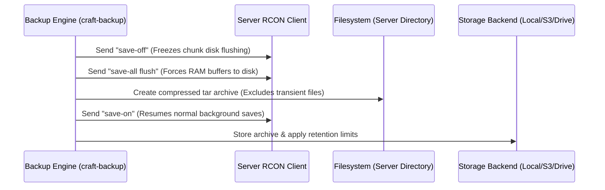

# Backup Systems & Resilience Skill Guide

> **Domain**: Zero-Downtime Hot Backups, Multi-Cloud Storage & Restoration Safety  
> **Primary Location**: `crates/backup/`

---

## 1. Zero-Downtime Hot Backup Flow

Craft guarantees data consistency for active servers using an atomic RCON flush sequence:



### Invariant:
Even if archive compression fails or errors midway, the engine **must guarantee** that `save-on` is issued to avoid leaving the game server in a persistent non-saving state.

---

## 2. File Exclusion Discipline

When archiving server state, the following directories and transient files are strictly excluded:
- Directories: `logs/`, `crash-reports/`, `cache/`, `.craft/`
- Files: `*.tmp`, `*.sock`, `*.pid`, `session.lock`

Skipping these files reduces archive size by up to 40% and avoids storing locked file descriptors.

---

## 3. Storage Backends

### 3.1. Local Storage
- Snapshots stored in `~/.craft/backups/<server-name>/`.
- Retention Policy: When `enforce_retention(engine, server, max_keep)` runs, backups sorted newest-first are preserved; older excess snapshots are automatically purged.

### 3.2. Amazon S3 & Compatible Stores
- Supported endpoints: Cloudflare R2, MinIO, Wasabi, Backblaze B2, DigitalOcean Spaces, AWS S3.
- Authentication: Built-in AWS Signature Version 4 (SigV4) HMAC-SHA256 request signing without requiring external heavy AWS SDKs.
- Configuration managed in `~/.craft/backup.toml`.

### 3.3. Google Drive
- Direct integration using OAuth2 client credentials and Google Drive v3 REST API.

---

## 4. Restoration Concurrency Safety Guard

Restoring an archive over an active game server causes catastrophic world corruption (split chunks, invalid level headers, and missing entity UUIDs).

```rust
// Strict safety invariant enforced in craft-backup
if craft_core::process::is_server_locked(server_path)
    || craft_core::process::get_server_running_pid(server_path).is_some()
{
    return Err(CraftError::Other(format!(
        "Cannot restore backup to server at '{}': The server is currently running. You MUST stop the server before restoring a backup.",
        server_path.display()
    )));
}
```

Never bypass this check unless running with explicit user overrides in non-interactive maintenance scripts.

---

## 5. High-Speed Zstandard (.tar.zst) Snapshot Engine

Craft defaults to Zstandard (`.tar.zst`) snapshot compression, delivering 3-5x faster compression throughput compared to standard gzip while maintaining superior compression ratios.

### 5.1. Dual Format Support (`BackupFormat`)
- **`BackupFormat::TarZstd`**: Uses `zstd::stream::write::Encoder` at default compression level 3 for sub-second snapshot creation on production servers.
- **`BackupFormat::TarGz`**: Legacy format preserved for maximum external tool interoperability.

### 5.2. Magic-Byte Auto-Detection on Restore
Restoration never relies purely on file extensions, which can be misnamed during manual operator file movements. It inspects the initial byte headers of the archive:
- **Zstandard Magic Bytes**: `[0x28, 0xB5, 0x2F, 0xFD]` -> Stream routed through `zstd::stream::read::Decoder`.
- **Gzip Magic Bytes**: `[0x1F, 0x8B]` -> Stream routed through `flate2::read::GzDecoder`.
- **Fallback**: If byte inspection cannot determine format, standard `.tar.zst` vs `.tar.gz` extension parsing applies.

```rust
let is_zstd = if magic.len() >= 4 && magic[0..4] == [0x28, 0xB5, 0x2F, 0xFD] {
    true
} else if magic.len() >= 2 && magic[0..2] == [0x1F, 0x8B] {
    false
} else {
    backup_path.to_string_lossy().ends_with(".tar.zst")
};
```

---

## 6. In-Process Daemon Backup Scheduling

Rather than relying on host crontabs or systemd timers, `craft-daemon` includes a built-in background scheduler (`DaemonScheduler`):

1. **Policy Configuration**: Stored per-server in `~/.craft/servers.toml` under `AutoBackupPolicy`:
   - `enabled`: Boolean toggle.
   - `interval_seconds`: Fallback interval in seconds (or shorthand notation like `every 6h`).
   - `cron_expression`: Standard 5-field cron syntax (`minute hour dom month dow`).
   - `retention_count`: Maximum retained local archives.
   - `format`: Desired compression format (`tar.zst` or `tar.gz`).
2. **Scheduling Loop**:
   - Evaluates schedule matching every 30 seconds.
   - Prevents overlapping backups for the same server via active-run lock tracking.
   - Enforces zero-downtime RCON saves if the server is running, or clean disk archiving if stopped.
   - Automatically executes retention pruning upon backup completion.

