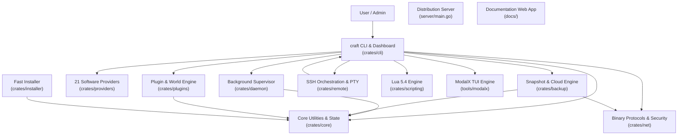

# In-Depth Project Analysis: Craft

> **Repository**: `OguzhanUmutlu/craft`  
> **Type**: Multi-crate Rust Workspace CLI & Background Supervisor Daemon, Standalone Fast Installer, Go Distribution Server, and Documentation Portals  
> **Primary Language**: Rust (2021 Edition)  
> **Codebase Scale**: ~32,000+ Rust lines across 11 workspace crates (plus Go, React/TSX, VitePress, and Shell tooling)  
> **Current Version**: `v1.0.0`

---

## 1. Executive Overview

**Craft** is a high-performance, modular server management suite, background supervisor daemon, interactive terminal user interface (TUI), and remote orchestration engine designed for Minecraft and dedicated game servers. It bridges the gap between basic CLI wrappers and complex multi-server panels (such as Pterodactyl or AMP), packing full server lifecycle orchestration into a single native binary (<15 MB) with sub-millisecond startup times and a minimal memory footprint (<10 MB RSS for the daemon supervisor).

Craft provides end-to-end server lifecycle management across **21 server platforms** spanning Java Edition, Bedrock Edition, Proxies, and Native Game Engines (Factorio, Terraria, Palworld, Valheim, and Custom Lua/Binary engines). It features typed IPC background supervision, atomic zero-downtime hot backups, cross-platform remote orchestration over SSH, native binary protocol diagnostics (SLP, RakNet, A2S_INFO, RCON), multi-repository plugin/mod management, Zstandard-compressed caching, and an interactive TUI dashboard driven by ModalX.

---

## 2. Workspace Composition and Technology Stack

| Layer / Component | Technology Stack | Primary Location | Scope / Role |
| :--- | :--- | :--- | :--- |
| **`craft-core`** | Rust, `serde`, `toml`, `fs2`, `sysinfo`, `sha2`, `zstd` | `crates/core/` | Configuration, paths, Java discovery, bytecode inspection, process locks, LRU zstd cache, non-destructive trash bin, registries (`ServersRegistry`, `RemotesRegistry`, `GlobalBackupRegistry`) |
| **`craft-providers`** | Rust, `reqwest`, `tokio`, `futures-util` | `crates/providers/` | 21 server platforms, dynamic declarative provider loader, asset downloading, upstream API resolvers, start script generation, JVM GC tuning profiles (`--aikar`, `--zgc`, `--shenandoah`) |
| **`craft-daemon`** | Rust, `tokio` (Unix Sockets / Windows Named Pipes) | `crates/daemon/` | Detached supervisor service, circular 50k-line ring-buffer log replay, console broadcast, auto-restart, OS service units (systemd, launchd, schtasks) |
| **`craft-net`** | Rust, `tokio`, `bytes` | `crates/net/` | Java SLP (TCP VarInt), Bedrock RakNet (UDP 0x01), Valve A2S_INFO query, async RCON client, OS firewall automation (iptables, UFW, netsh, pfctl), Windows UWP loopback exemption |
| **`craft-plugins`** | Rust, `reqwest`, `zip` | `crates/plugins/` | Unified search across Modrinth, Hangar, Poggit; universal community map resolver (Direct, Drive, Dropbox, MediaFire, GitHub); NBT inspection and dimension management |
| **`craft-backup`** | Rust, `flate2`, `tar`, `chrono`, AWS S3 HMAC, GDrive | `crates/backup/` | Zero-downtime RCON-flushed tar.gz snapshots, selective world backups, retention enforcement, Local / S3 / Google Drive storage backends, running server safety locks |
| **`craft-remote`** | Rust, `ssh2`, `crossterm` | `crates/remote/` | Multi-node SSH fleet management, SFTP synchronization, tri-platform remote bootstrapping, interactive remote PTY proxy |
| **`craft-scripting`** | Rust, `mlua` (Lua 5.4 vendored) | `crates/scripting/` | Sandboxed Lua scripting engine, `craft.*` stdlib, dynamic software definition packaging, starter template generation |
| **`modalx`** | Rust, `crossterm`, `unicode-width` | `tools/modalx/` | Bounded centered box frames (84 cols default), selection/confirm/table/form/waiting/input modals, readline `TextInput`, left/right navigation, zero-emoji styling |
| **`craft-cli`** | Rust, `clap`, `crossterm`, `comfy-table` | `crates/cli/` | Main CLI executable, 30 command handlers, full-screen interactive TUI dashboard, live log streaming with chunked seek reader |
| **`craft-installer`** | Rust, `zstd` | `crates/installer/` | Standalone ultra-fast self-extracting installer (<35ms decompression), PATH configuration |
| **Distribution Server** | Go 1.22+, `net/http`, `log/slog` | `server/` | Fast artifact distribution, automated SHA256 checksums, install script templating (`install.sh`, `install.ps1`) |
| **Documentation Portals** | React 18, Vite 6, TailwindCSS 3 / VitePress | `docs/` & `tools/modalx/docs/` | Web documentation portals with GitHub Pages deployment workflow |

---

## 3. Detailed Subsystem Audit: What Is Currently Implemented

### 3.1. `craft-core`: Foundation, Discovery, and Safety
- **Path Management (`CraftPaths`)**:
  - Anchored at `CRAFT_HOME` (`~/.craft` by default).
  - Directory structure initialized on demand: `servers/`, `cache/`, `backups/`, `run/`, `run/locks/`, `trash/`.
  - Resolution helpers for server working directories, local vs absolute paths, and lock files.
- **Java Discovery and Bytecode Matching (`java.rs`)**:
  - `get_jar_java_version`: Opens server JAR as a ZIP archive, inspects `.class` headers for the `0xCAFEBABE` magic number, extracts class file major version (52 = Java 8, 61 = Java 17, 65 = Java 21, etc.).
  - `get_java_installations`: Auto-discovers JDK installations across Linux standard directories (`/usr/lib/jvm`), macOS paths (`/Library/Java/JavaVirtualMachines`), Windows Registry / Program Files, `JAVA_HOME`, and system `PATH`.
  - `find_best_java`: Matches JAR bytecode requirements against installed JDK runtimes and selects the optimal binary path.
- **High-Performance Zstandard Disk Cache (`cache.rs`)**:
  - Stores binary artifacts in `cache/artifacts/` and zstd-compressed metadata in `cache/meta/`.
  - Supports hardlink deduplication for zero-copy server file deployments.
  - LRU eviction down to 75% capacity when `cache_max_bytes` watermark is exceeded.
  - Compressed artifact helpers: `put_artifact_compressed`, `get_artifact_data`, `extract_artifact_to`, `list_cached_artifacts`.
- **Non-Destructive Trash Bin (`trash.rs`)**:
  - Replaces destructive `rm -rf` with recoverable staging in `~/.craft/trash/`.
  - Tracks UUIDs, original paths, deletion timestamps, and SHA-256 hashes in `trash/manifest.toml`.
  - Supports both files and recursive directories (`trash_path`, `dir_size_bytes`, `compute_dir_hash`).
  - Safe restoration (`craft trash restore <id>`) and permanent purge (`craft trash empty`).
- **Process Locking & Auto-Healing (`process.rs`)**:
  - `ServerLockGuard`: Exclusive OS-level file lock on `server.lock` (`fs2::FileExt`) preventing concurrent executions.
  - `auto_heal_server_jar`: Scans server directory for variant JAR names (e.g. `paper-1.21.4-123.jar`) and repairs broken structures.
- **Transactional Registries**:
  - `ServersRegistry`: Records registered server paths, software ID, version, memory allocation, JVM arguments, Java path, and auto-run status.
  - `RemotesRegistry`: Stores remote SSH host configurations, aliases, credentials, and connection settings.
  - `GlobalBackupRegistry`: Stores backup storage provider configurations (Local, S3, Google Drive) and default settings.
- **Server Properties (`properties.rs`)**:
  - Parsing, mutation, and serialization of `server.properties`.
  - Comprehensive documentation descriptions for every standard Java and Bedrock configuration key.
  - Dynamic display formatting without premature ellipsis truncation on wide viewports.

---

### 3.2. `craft-providers`: 21 Server Platforms & Dynamic Extensibility
- **Unified Provider Trait (`ServerSoftware`)**:
  - Consistent interface for software identity, edition (Java, Bedrock, Proxy, Native, Custom), version enumeration, asset resolution, post-download hooks, and start script generation.
- **21 Supported Platforms**:
  1. Modern Java: Paper, Purpur, Folia, Vanilla Java.
  2. Modded Java: Fabric, Quilt, NeoForge.
  3. Legacy Java: Spigot (BuildTools automation).
  4. Bedrock Dedicated: Vanilla BDS, PocketMine-MP, NukkitX.
  5. Proxies: Velocity, Waterfall, BungeeCord, GeyserMC, WaterdogPE.
  6. Native Dedicated Servers: Factorio, Terraria, Palworld, Valheim.
  7. Custom Engines: Custom binary/script engines via declarative TOML definitions (`craft.custom.toml`).
- **Embedded Catalogs & Offline Fallbacks**:
  - In-memory embedded fallback version lists for all providers, allowing instant offline deployment when upstream APIs are unavailable.
- **GC Profile Generation**:
  - `--aikar`: Optimized G1GC tuning (`-XX:+UseG1GC`, `-XX:G1ReservePercent=20`, optimized survivor ratios).
  - `--zgc`: Generational / Ultra-low latency ZGC (`-XX:+UseZGC`).
  - `--shenandoah`: Red Hat low-pause garbage collection.

---

### 3.3. `craft-daemon`: Supervisor Service and IPC
- **Cross-Platform IPC**:
  - Unix domain socket at `~/.craft/run/daemon.sock` on Linux/macOS.
  - Named pipe at `\\.\pipe\craft-daemon` on Windows.
  - Fully typed request/response protocol (`IpcRequest` / `IpcResponse`).
- **Circular Log Ring Buffer**:
  - Holds up to 50,000 log lines per running server in memory.
  - Replays recent backlog immediately when a client connects via `craft view` or TUI console.
- **Console Streaming & Stdin Injection**:
  - Bidirectional stream proxying stdin commands and broadcasting stdout/stderr.
  - Carriage return (`\r`) stripping and empty line suppression to prevent double-spaced rendering.
  - Persistent disk logging to `<server_path>/logs/console.log`.
- **OS Service Integration**:
  - Linux: Generates and registers user systemd service units (`~/.config/systemd/user/craft.service`).
  - macOS: Generates LaunchAgent property lists (`~/Library/LaunchAgents/com.craft.daemon.plist`).
  - Windows: Scheduled task automation via `schtasks.exe`.

---

### 3.4. `craft-net`: Network Protocols & Firewall Isolation
- **Minecraft Server List Ping (SLP)**:
  - Pure Rust implementation of 0x00 Handshake and Status Request over TCP with VarInt framing.
  - Decodes JSON descriptions, player counts (online/max), latency measurements, and MOTDs without external dependencies.
- **Bedrock RakNet Ping**:
  - Unconnected UDP ping (`0x01`) decoding server GUID, edition string, and world name.
- **Valve A2S_INFO Protocol**:
  - UDP query implementation for native dedicated game servers (Palworld, Valheim).
- **Asynchronous RCON Client**:
  - Full RFC-compliant RCON client with authentication, command dispatch, and multi-packet response handling.
- **OS Firewall Automation**:
  - Programmatically provisions firewall rules (`ufw`, `iptables`, `pfctl`, `netsh advfirewall`) to lock server ports to trusted IPs or proxies.
- **Windows UWP Loopback Exemption**:
  - Adds AppContainer loopback exemption for `Microsoft.MinecraftUWP` to allow connecting to localhost Bedrock servers.

---

### 3.5. `craft-plugins`: Plugins, Curated Maps & Community Downloads
- **Multi-Repository Plugin Search**:
  - Aggregated search and installation across Modrinth, Hangar (PaperMC), and Poggit (PocketMine-MP).
  - Version compatibility resolution and direct JAR/phar installation.
- **Universal Map Resolver (`map_resolver.rs`)**:
  - Direct archive support (`.zip`, `.mcworld`, `.tar.gz`).
  - URL resolvers for Google Drive, Dropbox (`dl=1`), GitHub Releases / Raw, and MediaFire.
  - Cloudflare Turnstile / Managed Challenge detection providing actionable mirror guidance.
- **Curated Community Map Catalog**:
  - 10 pre-configured popular community maps (SkyBlock, The Dropper, Diversity 3, Parkour Spiral, Medieval Village, Herobrine's Mansion, Terra Swoop Force, Castaway Island, Super Hostile, Futuristic Lobby).
- **Zstandard Compressed Caching**:
  - Automatic caching of downloaded plugins and world archives in zstd compression.
  - In-TUI cache inspection showing uncompressed sizes and compression ratios.
- **World & Player Management**:
  - Default Overworld, Nether, and The End world path switching in `server.properties`.
  - NBT player data inspection displaying coordinates, health, XP level, game mode, and dimension.

---

### 3.6. `craft-backup`: Hot Snapshots & Cloud Integration
- **RCON Zero-Downtime Flushes**:
  - Sends `save-off` and `save-all flush` over RCON prior to archiving, then sends `save-on` post-completion.
- **Selective Backups**:
  - `--world-only` flag skips server JARs and plugin binaries, backing up only level data and configuration.
- **Storage Providers**:
  - Local disk storage with automatic retention pruning (`enforce_retention`).
  - Amazon S3 and S3-compatible object stores (Cloudflare R2, MinIO, Wasabi, Backblaze B2, DigitalOcean Spaces) with AWS SigV4 HMAC-SHA256 signing.
  - Google Drive via OAuth2 REST API v3.
- **Server Running Safety Guard**:
  - Rejects backup restoration if the server is running or has an active `server.lock` to prevent world corruption.

---

### 3.7. `craft-remote`: Multi-Node Fleet Management
- **SSH Connection Pooling**:
  - Maintains persistent SSH sessions using `ssh2` with private key and password authentication.
- **Tri-Platform Remote Bootstrapping**:
  - Automated remote host setup on Linux, macOS, and Windows with progress callbacks.
- **Interactive PTY Proxy**:
  - Streams full interactive remote terminal sessions for console and dashboard management.
- **SFTP Synchronization**:
  - Bidirectional file transfers, remote server provisioning, and version parity verification.

---

### 3.8. `craft-scripting`: Sandboxed Lua 5.4 Automation
- **Embedded Lua Engine**:
  - Vendored Lua 5.4 via `mlua` with memory and instruction sandboxing.
- **Standard Library (`craft.*`)**:
  - Modules for file manipulation, server control, HTTP requests, properties editing, and process spawning.
- **Declarative Software Packages**:
  - Packaging custom server engines into shareable definitions with starter script generators.

---

### 3.9. `modalx`: Standalone Centered TUI Framework
- **Centered Bounded Box Frames**:
  - Default 84-column width with display column width calculations using `unicode-width` crate.
  - Prevents border tearing on wide or multibyte characters.
- **Component Suite**:
  - `SelectModal`, `ConfirmModal`, `TableModal`, `FormModal`, `WaitingModal`, `InputModal`, `MessageModal`.
- **Keyboard & Mouse Navigation**:
  - Configurable wrap-around (disabled by default), Left/Right arrow key shortcuts, Home/End, PageUp/PageDown, mouse wheel.
- **`TextInput` Engine**:
  - Readline editing (`Ctrl+A/E/U/K/W`, `Ctrl+Backspace`, `Alt+Backspace`), cursor navigation, command history.
- **Zero-Emoji Design**:
  - Plain typography and clean borders with no emojis across all screens.

---

### 3.10. `crates/cli`: Command Suite & Interactive Dashboard
- **30 Subcommands**:
  - `new`, `run`, `stop`, `view`, `ls`, `rm`, `load`, `ver`, `update`, `cache`, `service`, `auto`, `fix`, `plugin`, `ping`, `rcon`, `backup`, `firewall`, `loopback`, `template`, `dockerize`, `remote`, `deploy`, `software`, `script`, `trash`, `world`, `dev`, `status`, `dashboard`.
- **Interactive TUI Dashboard**:
  - Full-screen dashboard with system resource header, paged server navigation, server actions, memory adjustment, JVM JDWP debugger configuration, plugin manager, world manager, and live console streaming.
- **Virtual Scrolling Console**:
  - Chunked seek-based log reader (16 KB chunks from file end) capped at 200 items in RAM.
  - Inside-the-box anchored command input prompt.

---

### 3.11. Auxiliary Systems
- **`craft-installer`**:
  - Standalone self-extracting executable (<35ms install time) with embedded zstd decompression.
- **Distribution Server (`server/main.go`)**:
  - Go HTTP distribution service providing version checks, download endpoints, and dynamically templated `install.sh` / `install.ps1`.
- **Documentation Portals**:
  - React 18 / Vite 6 portal in `docs/` and VitePress documentation in `tools/modalx/docs/`.

---

## 4. Architectural Summary

| Pillar | Status | Core Architecture |
| :--- | :--- | :--- |
| **Safety** | High | OS file locking (`server.lock`), non-destructive trash bin, restore prevention while server runs |
| **Performance** | High | Zstandard compression, LRU disk cache, chunked seek log reader, <10 MB RSS daemon |
| **Observability** | High | 50k-line ring buffer, live console streaming, binary protocol ping diagnostics (SLP, RakNet, A2S) |
| **Extensibility** | High | 21 software providers, declarative dynamic TOML engines, embedded Lua 5.4 scripting |
| **User Experience** | High | Centered ModalX TUI, full CLI/TUI parity, zero-emoji aesthetic |
